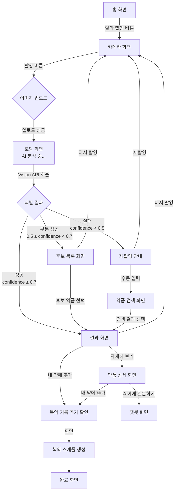
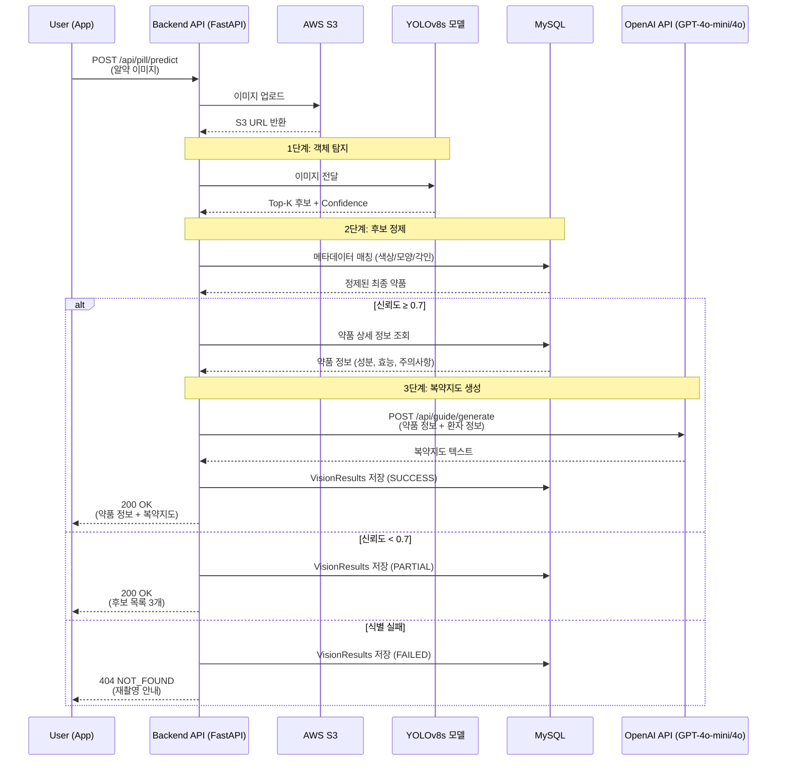

# 🔴 P0-1 — 알약 식별 (Vision AI) 상세 명세

> 상위 문서: [[P0 - MVP 핵심기능]] | [[🏠 요약 - 프로젝트 홈]]

---

## 📋 기능 개요

| 항목 | 내용 |
|------|------|
| **기능명** | 알약 식별 (Vision AI) |
| **목표** | 앱 카메라로 알약을 촬영하면 약품 정보를 자동 인식 |
| **사용자** | 환자, 보호자 |
| **우선순위** | P0 (MVP 필수) |
| **핵심 기술** | GLM-5 Vision API, YOLOv8 (옵션) |
| **정확도 목표** | 98% 이상 |

---

## 🎯 사용자 시나리오

### 시나리오 1: 70세 당뇨 환자
```
김할머니(70세, 당뇨 환자)가 여러 약을 복용 중입니다.
약 봉투에서 하얀 동그란 알약을 꺼냈는데, 어떤 약인지 기억이 나지 않습니다.

1. 요약 앱을 실행하고 홈 화면에서 "알약 촬영" 버튼을 탭합니다.
2. 카메라 화면이 나타나고, 가이드 박스 안에 알약을 놓습니다.
3. "촬영" 버튼을 누릅니다.
4. 5초 이내에 결과 화면이 나타납니다:
   - "타이레놀정 500밀리그램"
   - 약품 이미지, 성분명(아세트아미노펜)
   - "해열·진통제. 두통, 치통, 근육통에 사용합니다."
5. "자세히 보기" 버튼을 눌러 상세 정보를 확인합니다.
6. "내 약에 추가" 버튼을 눌러 복약 기록에 저장합니다.
```

### 시나리오 2: 보호자가 대신 촬영
```
홍길동(45세)이 부모님 댁을 방문했습니다.
어머니가 복용 중인 약 중 정체불명의 알약이 있습니다.

1. 요약 앱에서 "가족 관리" 탭으로 이동합니다.
2. "어머니(홍부모)" 프로필을 선택합니다.
3. "알약 촬영" 버튼을 탭합니다.
4. 알약을 촬영하고 식별 결과를 확인합니다.
5. "어머니 약에 추가" 버튼을 눌러 어머니의 복약 기록에 저장합니다.
6. 어머니의 스마트폰에 푸시 알림이 전송됩니다:
   "자녀(홍길동)님이 새로운 약을 추가했습니다."
```

---

## 🖼️ 화면 플로우

### 화면 플로우 다이어그램


---

## 📱 화면 상세 명세

### 1. 카메라 화면

#### UI 요소
- **카메라 뷰파인더**: 전체 화면
- **가이드 박스**: 중앙에 반투명 원형 가이드 (알약 배치 위치 안내)
- **안내 텍스트**: "가이드 안에 알약을 놓고 촬영하세요"
- **촬영 버튼**: 하단 중앙, 크기 60x60px (시니어 모드: 80x80px)
- **갤러리 버튼**: 하단 좌측 (기존 사진 선택)
- **플래시 토글**: 상단 우측
- **닫기 버튼**: 상단 좌측

#### 시니어 모드
- 안내 텍스트 폰트 크기: 24px → 36px
- 음성 안내 자동 재생: "가이드 안에 알약을 놓고 촬영 버튼을 눌러주세요"
- 고대비 색상: 가이드 박스 테두리 #00FF00 (녹색)

#### 접근성
- 음성 안내 (TTS)
- VoiceOver / TalkBack 지원
- 진동 피드백 (촬영 완료 시)

---

### 2. 로딩 화면

#### UI 요소
- **로딩 스피너**: 중앙
- **진행 텍스트**: "AI가 알약을 분석하고 있습니다..."
- **진행률 표시**: 0% → 100% (실시간 업데이트)
- **취소 버튼**: 하단 (API 호출 취소)

#### 로딩 단계 안내
1. "이미지 업로드 중..." (0-30%)
2. "AI 분석 중..." (30-80%)
3. "약품 정보 검색 중..." (80-100%)

#### 시간 제한
- **타임아웃**: 10초
- 10초 초과 시 에러 화면으로 전환

---

### 3. 결과 화면

#### UI 요소
- **약품 이미지**: 상단 (200x200px, 식약처 제공 이미지)
- **약품명**: 이미지 하단, 폰트 크기 20px (시니어: 30px)
- **제조사**: 약품명 하단, 회색 텍스트
- **신뢰도 배지**: 우측 상단 (예: "정확도 95%")
- **핵심 정보 카드**:
  - 성분명
  - 분류 (전문/일반)
  - 효능 (1줄 요약)
- **액션 버튼**:
  - "자세히 보기" (Primary)
  - "내 약에 추가" (Secondary)
  - "다시 촬영" (Tertiary)

#### 신뢰도별 UI 분기
| 신뢰도 | 배지 색상 | 안내 메시지 |
|--------|-----------|-------------|
| ≥ 0.9 | 녹색 | "정확하게 식별했습니다" |
| 0.7 ~ 0.9 | 주황색 | "식별 결과를 확인하세요" |
| < 0.7 | 빨간색 | "정확하지 않을 수 있습니다. 약사와 확인하세요" |

---

### 4. 후보 목록 화면 (신뢰도 < 0.7)

#### UI 요소
- **안내 메시지**: "여러 후보가 있습니다. 정확한 약품을 선택하세요."
- **후보 리스트**: 최대 3개
  - 각 항목: 약품 이미지 + 이름 + 신뢰도
  - 정렬: 신뢰도 내림차순
- **액션 버튼**:
  - "이 약이 맞아요" (각 항목마다)
  - "다시 촬영"
  - "수동 검색"

---

## 🔄 알약 식별 파이프라인 (3단계 역할 분리)

### 1단계: 알약 객체 탐지 (Object Detection)
**담당**: YOLOv8s (Ultralytics)
**역할**:
- **입력**: 사용자가 촬영한 알약 이미지 (PNG/JPG)
- **출력**: Bounding Box, 클래스 후보 (Top-K), Confidence Score
- **처리**: 이미지 내 알약 영역 검출, 초기 분류

**선택 이유**:
- 실시간 추론 + 학습/서빙 생태계 성숙
- Docker/FastAPI 연동 용이
- 가성비 밸런스

**👉 이 단계는 LLM이 아니라 YOLO 컴퓨터 비전 모델이 담당합니다.**

---

### 2단계: 후보 정제 (Metadata Filtering)
**담당**: 백엔드 로직 (FastAPI 내부)
**역할**:
- **입력**: YOLO 출력 (Top-K 후보 + Confidence)
- **처리**:
  - 약품 DB와 메타데이터 매칭 (모양, 색상, 각인)
  - 규칙 기반 필터링 (예: 신뢰도 < 0.5 제외)
  - 후보 개수 축소 (Top-K → Top-3)
- **출력**: 정제된 최종 약품 (또는 Top-3 후보)

**👉 이 단계는 규칙 기반 처리로, LLM이 필요 없습니다.**

---

### 3단계: 복약지도 생성 (Medication Guide)
**담당**: OpenAI API (GPT-4o-mini / GPT-4o)
**역할**:
- **입력**: 식별된 약품 정보 (약품명, 성분, 효능) + 사용자 건강 프로필
- **처리**:
  - 환자 맞춤형 복약지도 텍스트 생성
  - 주의사항, 부작용, 복용법 요약
  - 시니어 친화적 언어로 재작성
- **출력**: 복약지도 텍스트 (200-300자)

**선택 이유**:
- OCR/식별 결과를 사람이 읽기 쉬운 복약지도로 변환
- 개인 맥락 반영 (나이, 질환, 주의사항 등)
- 헬스케어 1기 지원: 개발 기간 GPT-4o-mini, 배포/데모 기간 GPT-4o 사용

**👉 복약지도 생성은 LLM의 역할입니다.**

---

### 전체 처리 흐름 (Sequence Diagram)


---

### 각 단계의 기술 스택

| 단계 | 기술 | 역할 | LLM 사용 여부 |
|------|------|------|---------------|
| 1단계 | YOLOv8s | 알약 위치 탐지 + 후보 예측 | ❌ (컴퓨터 비전 모델) |
| 2단계 | FastAPI + MySQL | 메타데이터 재랭킹 | ❌ (규칙 기반 로직) |
| 3단계 | OpenAI API (GPT-4o-mini/4o) | 복약지도 생성 | ✅ (텍스트 생성) |

---

## 🧪 테스트 케이스

### 기능 테스트

#### TC-1: 정상 식별 (신뢰도 ≥ 0.9)
**입력:**
- 타이레놀정 500mg 알약 사진 (선명한 이미지, 조명 양호)

**예상 출력:**
- 약품명: "타이레놀정500밀리그램"
- 신뢰도: 0.95
- 상태: SUCCESS
- 처리 시간: < 5초

**수용 기준:**
- [ ] 5초 이내 결과 표시
- [ ] 신뢰도 배지 녹색
- [ ] "정확하게 식별했습니다" 메시지 표시

---

#### TC-2: 부분 식별 (신뢰도 0.7 ~ 0.9)
**입력:**
- 약간 흐릿한 알약 사진

**예상 출력:**
- 후보 목록 3개
- 1위: 타이레놀정 (0.78)
- 2위: 타이레놀이알서방정 (0.72)
- 3위: 아세트아미노펜정 (0.68)

**수용 기준:**
- [ ] 후보 목록 화면 표시
- [ ] "정확한 약품을 선택하세요" 안내 메시지
- [ ] "다시 촬영" 버튼 제공

---

#### TC-3: 식별 실패 (신뢰도 < 0.5)
**입력:**
- 매우 흐릿하거나 알약이 없는 사진

**예상 출력:**
- 에러 코드: `NO_PILL_DETECTED`
- 메시지: "알약을 찾을 수 없습니다. 다시 촬영해주세요."

**수용 기준:**
- [ ] 재촬영 안내 화면 표시
- [ ] "촬영 팁" 제공 (밝은 곳에서, 가까이 촬영 등)
- [ ] "수동 검색" 옵션 제공

---

#### TC-4: 타임아웃
**입력:**
- 네트워크 지연으로 10초 초과

**예상 출력:**
- 에러 코드: `TIMEOUT`
- 메시지: "처리 시간이 초과되었습니다. 다시 시도해주세요."

**수용 기준:**
- [ ] 10초 후 자동 취소
- [ ] 에러 메시지 표시
- [ ] "재시도" 버튼 제공

---

#### TC-5: 시니어 모드
**입력:**
- 시니어 모드 활성화 + 알약 촬영

**예상 출력:**
- 큰 글씨 UI
- 음성 안내 자동 재생: "타이레놀정 500밀리그램이 맞습니다"

**수용 기준:**
- [ ] 폰트 크기 150% 적용
- [ ] TTS 자동 재생
- [ ] "다시 듣기" 버튼 제공
- [ ] 고대비 색상 적용

---

### 성능 테스트

#### PT-1: 응답 시간
- **목표**: 95% 요청이 5초 이내
- **측정**: 이미지 업로드 → 결과 화면 표시
- **부하**: 동시 100명 사용자

---

#### PT-2: 정확도
- **목표**: 98% 이상 정확도
- **테스트 세트**: AIhub 경구약제 이미지 1,000장
- **측정**: Top-1 정확도, Top-3 정확도

---

### 보안 테스트

#### ST-1: 이미지 크기 제한
- **입력**: 15MB 이미지 업로드
- **예상**: `IMAGE_TOO_LARGE` 에러 (최대 10MB)

---

#### ST-2: 악성 파일 업로드
- **입력**: .exe 파일을 이미지로 위장
- **예상**: `INVALID_IMAGE_FORMAT` 에러

---

## ⚠️ 에러 처리

### 에러 케이스 및 대응

| 에러 코드 | HTTP | 원인 | 사용자 메시지 | 액션 |
|-----------|------|------|---------------|------|
| `NO_PILL_DETECTED` | 404 | 이미지에서 알약 미감지 | "알약을 찾을 수 없습니다. 다시 촬영해주세요." | 재촬영 / 수동 검색 |
| `LOW_CONFIDENCE` | 422 | 신뢰도 < 0.5 | "정확하게 식별할 수 없습니다. 약사와 확인하세요." | 재촬영 / 수동 검색 / 약사 상담 |
| `VISION_API_ERROR` | 502 | GLM-5 API 호출 실패 | "일시적인 오류가 발생했습니다. 잠시 후 다시 시도해주세요." | 재시도 |
| `IMAGE_TOO_LARGE` | 400 | 이미지 크기 > 10MB | "이미지가 너무 큽니다. 더 작은 이미지를 선택하세요." | 다른 이미지 선택 |
| `INVALID_IMAGE_FORMAT` | 400 | 지원하지 않는 형식 | "지원하지 않는 이미지 형식입니다. (JPG, PNG만 가능)" | 다른 이미지 선택 |
| `TIMEOUT` | 408 | 처리 시간 > 10초 | "처리 시간이 초과되었습니다. 다시 시도해주세요." | 재시도 |
| `NETWORK_ERROR` | 0 | 인터넷 연결 없음 | "인터넷 연결을 확인하세요." | Wi-Fi/모바일 데이터 확인 |

---

## 📊 데이터 모델

### VisionResults 테이블 (참조)
```sql
CREATE TABLE VisionResults (
    vision_id UUID PRIMARY KEY,
    user_id UUID NOT NULL REFERENCES Users(user_id),
    image_url VARCHAR(500) NOT NULL,
    detected_medication_id UUID REFERENCES Medications(medication_id),
    detected_name VARCHAR(255),
    confidence_score FLOAT,
    raw_response JSONB,
    status ENUM('SUCCESS', 'PARTIAL', 'FAILED'),
    created_at TIMESTAMP DEFAULT CURRENT_TIMESTAMP
);
```

---

## 🎨 디자인 가이드

### 색상
- **Primary**: #4CAF50 (녹색) - 성공, 정확
- **Warning**: #FF9800 (주황) - 주의
- **Error**: #F44336 (빨강) - 실패, 위험
- **Background**: #FFFFFF (흰색) / #121212 (다크 모드)

### 타이포그래피
- **약품명**: Pretendard Bold, 20px (시니어: 30px)
- **안내 텍스트**: Pretendard Regular, 16px (시니어: 24px)
- **버튼 텍스트**: Pretendard SemiBold, 18px (시니어: 26px)

### 버튼 크기
- **일반 모드**: 최소 44x44px (iOS HIG)
- **시니어 모드**: 최소 60x60px (더 큰 터치 영역)

---

## 🔗 관련 API

- `POST /api/vision/identify` - 알약 식별
- `GET /api/vision/history` - 식별 이력 조회
- `GET /api/medications/:medicationId` - 약품 상세 정보

자세한 API 명세는 [[API 명세서]] 참조

---

## 📚 관련 문서

- [[P0 - MVP 핵심기능]]
- [[API 명세서]]
- [[ERD - 데이터베이스 설계]]
- [[시스템 아키텍처 설계]]
- [[UI·UX 디자인 가이드]]

---

## ✅ 수용 기준 (Definition of Done)

- [ ] 알약 촬영 후 5초 이내 결과 표시
- [ ] 신뢰도 98% 이상 (테스트 세트 1,000장 기준)
- [ ] 인식 실패 시 "다시 촬영해주세요" 안내 노출
- [ ] 인식 결과에 약품명 + 성분 + 효능 표시
- [ ] 시니어 모드에서 큰 글씨 + TTS 자동 재생
- [ ] "다시 듣기" 버튼 제공
- [ ] 갤러리에서 사진 선택 기능
- [ ] 에러 케이스 (이미지 크기, 형식, 타임아웃) 처리
- [ ] VoiceOver / TalkBack 접근성 지원
- [ ] 보호자가 환자 대신 촬영 및 추가 가능
- [ ] 모든 화면에 "본 서비스는 의료 전문가의 상담을 대체하지 않습니다" 면책 문구 노출

---

*최종 수정: 2026-02-23 | 버전: v1.0 | 작성자: 기획자*
