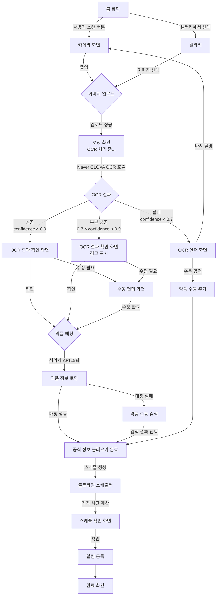
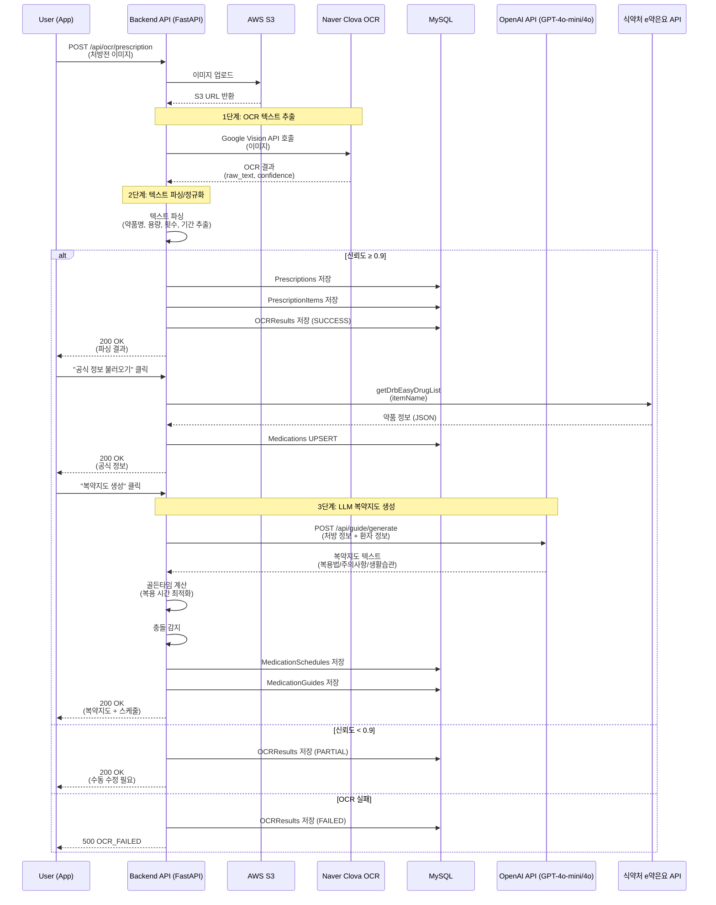

# 🔴 P0-2 — 복약지도문 OCR 상세 명세

> 상위 문서: [[P0 - MVP 핵심기능]] | [[🏠 요약 - 프로젝트 홈]]

---

## 📋 기능 개요

| 항목 | 내용 |
|------|------|
| **기능명** | 복약지도문 OCR 스캔 및 자동 알림 |
| **목표** | 처방전/약 봉투 촬영 → 텍스트 추출 → 복용 알림 자동 생성 |
| **사용자** | 환자, 보호자, 약사 |
| **우선순위** | P0 (MVP 필수) |
| **핵심 기술** | Naver Clova OCR, OpenAI API (GPT-4o-mini/4o), 자연어 파싱 |
| **정확도 목표** | OCR 98% 이상 |

---

## 🎯 사용자 시나리오

### 시나리오 1: 환자가 약국에서 받은 처방전 스캔
```
이영희(55세, 고혈압 환자)가 병원에서 진료 후 약국에서 약을 받았습니다.
약사가 복약 지도를 설명했지만, 집에 와서 다시 확인하고 싶습니다.

1. 약 봉투와 함께 받은 복약지도문을 꺼냅니다.
2. 요약 앱을 열고 홈 화면에서 "처방전 스캔" 버튼을 탭합니다.
3. 카메라가 실행되고, 복약지도문을 촬영합니다.
4. AI가 자동으로 텍스트를 인식합니다:
   - 병원명: 서울대학교병원
   - 처방일: 2026-02-23
   - 약품 목록:
     * 타이레놀정 500mg - 1회 1정, 1일 3회, 식후 30분, 7일분
     * 아스피린장용정 100mg - 1회 1정, 1일 1회, 아침 식후, 30일분
5. "OCR 결과 확인" 화면이 나타나고, 잘못 인식된 부분을 수정할 수 있습니다.
6. "확인" 버튼을 누르면:
   - 복약 스케줄이 자동 생성됩니다.
   - 타이레놀: 매일 오전 8시 30분, 오후 1시 30분, 오후 7시 30분
   - 아스피린: 매일 오전 8시 30분
7. 스마트폰 알림이 자동으로 등록됩니다.
```

### 시나리오 2: 약사가 직접 푸시 발송
```
약국의 김약사가 조제 완료 후 환자에게 복약 지도를 전송하려고 합니다.

1. 약사 전용 웹 관리 도구에 로그인합니다.
2. 환자 이름(홍길동)과 생년월일을 입력하여 검색합니다.
3. 환자 프로필에서 "복약 지도 전송" 버튼을 클릭합니다.
4. 복약지도문 템플릿을 작성합니다:
   - 약품: 타이레놀정 500mg
   - 복용법: 1회 1정, 1일 3회, 식후 30분
   - 특별 주의사항: "음주 시 간 손상 위험이 있으니 주의하세요."
5. "푸시 발송" 버튼을 클릭합니다.
6. 환자의 스마트폰에 푸시 알림이 전송됩니다:
   "서울약국에서 복약 안내를 보냈습니다."
7. 환자가 알림을 탭하면:
   - 복약지도문 전문이 나타납니다.
   - TTS로 자동 읽어줍니다 (시니어 모드).
   - "스케줄 자동 생성" 버튼을 눌러 알림을 등록합니다.
```

### 시나리오 3: 보호자가 부모님 처방전 대신 스캔
```
홍길동이 부모님의 처방전을 대신 스캔하여 등록합니다.

1. 요약 앱에서 "가족 관리" 탭으로 이동합니다.
2. "어머니(홍부모)" 프로필을 선택합니다.
3. "처방전 스캔" 버튼을 탭합니다.
4. 어머니의 처방전을 촬영합니다.
5. OCR 결과 확인 후 "어머니 처방전에 추가"를 선택합니다.
6. 어머니의 복약 스케줄이 자동 생성됩니다.
7. 어머니의 스마트폰에 알림:
   "자녀(홍길동)님이 새로운 처방전을 추가했습니다."
8. 홍길동의 스마트폰에도 어머니의 복약 시간 알림이 함께 전송됩니다.
```

---

## 🖼️ 화면 플로우

### 화면 플로우 다이어그램


---

## 📱 화면 상세 명세

### 1. 카메라 화면 (처방전/약 봉투)

#### UI 요소
- **카메라 뷰파인더**: 전체 화면
- **가이드 박스**: 직사각형 가이드 (A4 비율)
- **안내 텍스트**: "처방전 또는 약 봉투를 가이드 안에 맞추세요"
- **촬영 버튼**: 하단 중앙, 크기 60x60px (시니어: 80x80px)
- **갤러리 버튼**: 하단 좌측
- **플래시 토글**: 상단 우측
- **자동 촬영 모드**: 문서 감지 시 자동 촬영 (옵션)

#### 촬영 팁 표시
- "밝은 곳에서 촬영하세요"
- "처방전이 평평하게 펴져 있어야 합니다"
- "그림자가 생기지 않게 주의하세요"

#### 시니어 모드
- 음성 안내: "처방전을 가이드 안에 맞추고 촬영 버튼을 눌러주세요"
- 자동 촬영 모드 기본 활성화

---

### 2. 로딩 화면 (OCR 처리)

#### UI 요소
- **진행 스피너**: 중앙
- **진행 텍스트**:
  1. "이미지 업로드 중..." (0-20%)
  2. "문자 인식 중..." (20-70%)
  3. "약품 정보 검색 중..." (70-100%)
- **취소 버튼**: 하단

#### 시간 제한
- **타임아웃**: 15초 (OCR은 Vision보다 복잡)
- 15초 초과 시 에러 화면

---

### 3. OCR 결과 확인 화면

#### UI 요소
- **원본 이미지**: 상단 (썸네일, 탭하면 확대)
- **신뢰도 표시**: 우측 상단 배지 (예: "정확도 95%")
- **파싱된 정보 카드**:

  #### 처방전 기본 정보
  - 병원명: `[수정 가능]`
  - 처방일: `[수정 가능]`
  - 약국명: `[선택 입력]`

  #### 약품 목록 (리스트)
  각 약품마다:
  - 약품명: `[자동 완성 검색]`
  - 복용량: `[수정 가능]`
  - 횟수: `[드롭다운]` (1일 1회, 2회, 3회, 4회)
  - 복용 시점: `[드롭다운]` (식전, 식후 30분, 공복, 취침 전 등)
  - 기간: `[숫자 입력]` 일
  - 주의사항: `[자유 입력]`

- **식약처 정보 불러오기 버튼**: 각 약품마다
  - "공식 정보 불러오기" (1단계: MFDS API 호출)
  - 성공 시: 효능, 용법, 주의사항 자동 채워짐

- **액션 버튼**:
  - "확인" (Primary) - 스케줄 생성으로 이동
  - "수동 편집" (Secondary)
  - "다시 촬영" (Tertiary)

#### 신뢰도별 UI 분기
| 신뢰도 | 배지 색상 | 안내 메시지 |
|--------|-----------|-------------|
| ≥ 0.9 | 녹색 | "정확하게 인식했습니다" |
| 0.7 ~ 0.9 | 주황색 | "일부 내용을 확인하세요" (문제 필드 하이라이트) |
| < 0.7 | 빨간색 | "인식이 정확하지 않습니다. 수동으로 수정하세요" |

---

### 4. 수동 편집 화면

#### UI 요소
- **원본 이미지**: 좌측 (고정)
- **편집 폼**: 우측
  - 각 필드를 직접 입력/수정
  - 약품 추가/삭제 버튼
- **음성 입력 버튼**: 각 필드마다 (음성으로 편집 가능)
- **자동 완성**: 약품명 입력 시 실시간 검색 결과 표시

---

### 5. 약품 매칭 및 공식 정보 불러오기 (1단계)

#### 플로우
1. 사용자가 "공식 정보 불러오기" 버튼 클릭
2. `POST /api/mfds/search` 호출 (식약처 e약은요 API)
3. 검색 결과 (최대 5개) 모달로 표시
4. 사용자가 정확한 약품 선택
5. 선택한 약품의 `efcyQesitm`, `useMethodQesitm`, `intrcQesitm` 등 자동 채워짐
6. 성공 메시지: "공식 정보를 불러왔습니다 ✓"

#### UI 요소
- **검색 결과 모달**:
  - 약품명, 제조사, 이미지
  - "이 약이 맞아요" 버튼 (각 결과마다)
- **실패 시**:
  - "검색 결과가 없습니다. 약품명을 수동으로 입력하세요."

---

### 6. 스케줄 확인 화면 (골든타임 스케줄러, 5단계)

#### UI 요소
- **자동 생성된 스케줄 미리보기**:
  - 약품별로 그룹화
  - 시간 순 정렬
  - 예시:
    ```
    매일 오전 8:00
    - 아스피린장용정 100mg (1정, 식후)

    매일 오전 8:30
    - 타이레놀정 500mg (1정, 식후 30분)

    매일 오후 1:30
    - 타이레놀정 500mg (1정, 식후 30분)
    ```

- **충돌 감지 경고** (5단계):
  - 두 약의 복용 시간이 너무 가까울 경우:
    ```
    ⚠️ 경고: 타이레놀과 아스피린의 복용 시간이 30분 차이입니다.
    권장: 최소 2시간 간격을 두세요.
    ```
  - "스케줄 최적화" 버튼 제공 → `/api/schedules/optimize` 호출

- **액션 버튼**:
  - "스케줄 최적화" (충돌이 있을 경우만 표시)
  - "시간 직접 조정"
  - "확인" (알림 등록)

---

## 🔄 전체 처리 플로우 (역할 분리 구조)

### 플로우 A: 처방문 OCR → 복약지도

**역할 분리:**
1. **Naver Clova OCR**: 처방전 텍스트 추출 (이미지 → 텍스트)
2. **백엔드 로직 (FastAPI)**: 텍스트 파싱/정규화 (약품명, 용량, 횟수, 기간 등)
3. **OpenAI API (GPT-4o-mini/4o)**: 복약지도 생성 (복용법, 주의사항, 생활습관)

**처리 단계:**
```
사용자 처방전/진료기록 이미지 업로드
    ↓
Naver Clova OCR로 텍스트 추출
    ↓
추출 텍스트를 파싱/정규화 (약품명, 용량, 횟수, 기간 등)
    ↓
파싱 결과 + 사용자 입력(나이/질환/주의사항 등)을 LLM에 전달
    ↓
복약지도(복용법/주의사항/생활습관) 생성 후 반환
```

---

### 플로우 B: 알약 이미지 식별 → 복약지도

**역할 분리:**
1. **YOLOv8**: 알약 위치 탐지 + 후보 예측
2. **백엔드 로직 (FastAPI)**: 메타데이터/DB로 재랭킹 (색상/모양/각인 등)
3. **LLM API (GPT-4o/GLM-5)**: 복약지도 생성

**처리 단계:**
```
사용자 알약 이미지 업로드
    ↓
YOLOv8 추론 → 탐지 결과(Top-K 후보)
    ↓
후보를 메타데이터/DB로 재랭킹 (색상/모양/각인 등)
    ↓
최종 약품(또는 Top-3 후보)을 LLM에 전달
    ↓
복약지도 생성 후 반환
```

---

### 백엔드 처리 흐름 (Sequence Diagram - 플로우 A)


---

### 기술 스택 역할 분리

| 단계 | 기술 | 역할 | 사용 이유 |
|------|------|------|-----------|
| OCR 텍스트 추출 | Naver Clova OCR | 처방전 이미지 → 텍스트 변환 | 한국어 특화, 헬스케어 1기 지원 (주제2 팀) |
| 알약 탐지 | YOLOv8s (Ultralytics) | 알약 위치 탐지 + 후보 예측 | 실시간 추론, 학습/서빙 생태계 성숙, Docker/FastAPI 연동 용이 |
| 파싱/정규화 | FastAPI (백엔드 로직) | 텍스트 구조화, 메타데이터 필터링 | 규칙 기반 처리로 빠르고 정확 |
| 복약지도 생성 | OpenAI API (GPT-4o-mini/4o) | 개인 맞춤 복약지도 문장 생성 | 헬스케어 1기 지원 — 개발: 4o-mini, 배포/데모: 4o |

**정의서 문장 예시:**
> "비전 모델(YOLO)로 식별/탐지를 수행하고, OCR 엔진(Naver Clova)으로 처방문 텍스트를 추출한 뒤, OpenAI API(GPT-4o-mini/4o)로 개인 맞춤 복약지도를 생성하는 3단 분리 구조로 설계하여 정확도·확장성·개발 효율을 확보하였다."

---

## 🧪 테스트 케이스

### 기능 테스트

#### TC-1: 정상 OCR (신뢰도 ≥ 0.9)
**입력:**
- 선명한 처방전 이미지
- 내용: 타이레놀정 500mg, 1회 1정, 1일 3회, 식후 30분, 7일분

**예상 출력:**
- 병원명: "서울대학교병원"
- 처방일: "2026-02-23"
- 약품명: "타이레놀정500밀리그램"
- 복용법: "1회 1정, 1일 3회, 식후 30분"
- 기간: 7일
- 신뢰도: 0.95

**수용 기준:**
- [ ] 15초 이내 결과 표시
- [ ] 모든 필드 정확하게 파싱
- [ ] "정확하게 인식했습니다" 메시지

---

#### TC-2: 식약처 API 연동 (1단계)
**입력:**
- OCR 결과에서 "타이레놀정500밀리그램" 인식
- "공식 정보 불러오기" 버튼 클릭

**예상 출력:**
- MFDS API 호출 성공
- 검색 결과 모달에 5개 결과 표시
- 사용자가 선택 후:
  - `efcyQesitm`: "해열·진통제. 두통, 치통..."
  - `useMethodQesitm`: "성인 1회 1~2정, 1일 3~4회..."
  - `intrcQesitm`: "다른 해열·진통제와 병용 금지..."
  - `itemImage`: "https://nedrug.mfds.go.kr/..."

**수용 기준:**
- [ ] 검색 결과 5초 이내 표시
- [ ] 선택한 약품의 공식 정보 자동 채워짐
- [ ] `intrcQesitm` 파싱하여 InteractionWarnings 자동 생성 (2단계)

---

#### TC-3: 골든타임 스케줄러 (5단계)
**입력:**
- 약 A: 1일 3회, 식후 30분
- 약 B: 1일 1회, 아침 식후
- 사용자가 평소 식사 시간: 8시, 13시, 19시

**예상 출력:**
- 자동 생성 스케줄:
  - 약 A: 8:30, 13:30, 19:30
  - 약 B: 8:30
- 충돌 감지:
  - ⚠️ 약 A와 약 B가 8:30에 겹칩니다.
- "스케줄 최적화" 제안:
  - 약 B: 8:00으로 변경 (식후 → 식전으로 조정 가능한 경우)
  - 또는 약 A: 9:00으로 변경

**수용 기준:**
- [ ] `useMethodQesitm` 파싱하여 최적 시간 자동 계산
- [ ] 충돌 감지 및 경고 표시
- [ ] "스케줄 최적화" 버튼 클릭 시 `/api/schedules/optimize` 호출
- [ ] 최적화된 스케줄 미리보기 제공

---

#### TC-4: 약사 푸시 발송
**입력:**
- 약사가 웹에서 환자 검색 (홍길동, 1990-01-01)
- 복약 지도 작성 및 푸시 발송

**예상 출력:**
- 환자 앱에 푸시 알림:
  - 제목: "서울약국에서 복약 안내를 보냈습니다"
  - 내용: "타이레놀정 500mg, 1일 3회 식후 30분 복용"
- 환자가 알림 클릭 → 복약지도문 전문 표시
- 시니어 모드: TTS 자동 재생

**수용 기준:**
- [ ] 약사 웹에서 환자 검색 가능
- [ ] 푸시 발송 성공 (FCM/APNS)
- [ ] 환자 앱에서 복약지도문 확인 가능
- [ ] "스케줄 자동 생성" 버튼 제공

---

#### TC-5: 보호자가 대신 스캔
**입력:**
- 보호자 계정으로 로그인
- "가족 관리" → "어머니" 선택
- 처방전 촬영 및 스캔

**예상 출력:**
- 처방전이 어머니의 계정에 저장
- 어머니 앱에 알림:
  - "자녀(홍길동)님이 새로운 처방전을 추가했습니다"
- 보호자 앱에도 어머니의 복약 스케줄 알림 수신 (설정에 따라)

**수용 기준:**
- [ ] 보호자가 환자 대신 처방전 추가 가능
- [ ] 환자에게 알림 전송
- [ ] 보호자가 `receive_missed_alerts=true`면 복약 알림도 수신

---

### 에러 테스트

#### TC-E1: OCR 실패 (신뢰도 < 0.7)
**입력:**
- 매우 흐릿한 처방전 이미지

**예상 출력:**
- 에러 코드: `OCR_FAILED`
- 메시지: "텍스트를 인식할 수 없습니다. 다시 촬영하거나 수동으로 입력하세요."

**수용 기준:**
- [ ] 에러 메시지 표시
- [ ] "다시 촬영" / "수동 입력" 버튼 제공

---

#### TC-E2: MFDS API 호출 실패
**입력:**
- "공식 정보 불러오기" 클릭
- 식약처 API 타임아웃

**예상 출력:**
- 에러 코드: `MFDS_API_ERROR`
- 메시지: "공식 정보를 불러올 수 없습니다. 나중에 다시 시도하세요."

**수용 기준:**
- [ ] 에러 메시지 표시
- [ ] "재시도" 버튼 제공
- [ ] 공식 정보 없이도 스케줄 생성 가능 (수동 입력)

---

## ⚠️ 에러 처리

| 에러 코드 | HTTP | 원인 | 사용자 메시지 | 액션 |
|-----------|------|------|---------------|------|
| `OCR_FAILED` | 500 | OCR 처리 실패 | "텍스트를 인식할 수 없습니다. 다시 촬영하거나 수동으로 입력하세요." | 재촬영 / 수동 입력 |
| `LOW_CONFIDENCE` | 422 | 신뢰도 < 0.7 | "인식이 정확하지 않습니다. 내용을 확인하고 수정하세요." | 수동 수정 |
| `MFDS_API_ERROR` | 502 | 식약처 API 실패 | "공식 정보를 불러올 수 없습니다. 나중에 다시 시도하세요." | 재시도 / 수동 입력 |
| `NO_RESULTS` | 404 | 약품 검색 결과 없음 | "검색 결과가 없습니다. 약품명을 확인하세요." | 약품명 수정 / 수동 입력 |
| `TIMEOUT` | 408 | 처리 시간 > 15초 | "처리 시간이 초과되었습니다. 다시 시도하세요." | 재시도 |

---

## 📊 데이터 모델

### Prescriptions 테이블 (참조)
```sql
CREATE TABLE Prescriptions (
    prescription_id UUID PRIMARY KEY,
    user_id UUID NOT NULL REFERENCES Users(user_id),
    pharmacist_id UUID REFERENCES Users(user_id),
    image_url VARCHAR(500),
    issue_date DATE,
    hospital_name VARCHAR(255),
    pharmacy_name VARCHAR(255),
    upload_source ENUM('USER_SCAN', 'PHARMACIST_PUSH'),
    created_at TIMESTAMP DEFAULT CURRENT_TIMESTAMP
);
```

### OCRResults 테이블 (참조)
```sql
CREATE TABLE OCRResults (
    ocr_id UUID PRIMARY KEY,
    prescription_id UUID REFERENCES Prescriptions(prescription_id),
    raw_text TEXT NOT NULL,
    parsed_data JSONB,
    confidence_score FLOAT,
    status ENUM('SUCCESS', 'PARTIAL', 'FAILED'),
    created_at TIMESTAMP DEFAULT CURRENT_TIMESTAMP
);
```

---

## 🎨 디자인 가이드

### 카메라 가이드 박스
- **색상**: #4CAF50 (녹색) 테두리
- **두께**: 2px
- **크기**: A4 비율 (210:297)
- **모서리**: 둥근 모서리 (border-radius: 8px)

### OCR 결과 확인 화면
- **신뢰도 배지**:
  - 높음 (≥ 0.9): 녹색 배경 (#4CAF50)
  - 중간 (0.7~0.9): 주황 배경 (#FF9800)
  - 낮음 (< 0.7): 빨강 배경 (#F44336)

### 약품 카드
- **배경**: 흰색 (#FFFFFF) / 다크 모드: #1E1E1E
- **테두리**: 1px solid #E0E0E0
- **그림자**: box-shadow: 0 2px 4px rgba(0,0,0,0.1)

---

## 🔗 관련 API

- `POST /api/prescriptions/upload` - 처방전 업로드 및 OCR
- `POST /api/mfds/search` - 식약처 e약은요 검색 (1단계)
- `POST /api/schedules/optimize` - 스케줄 최적화 (5단계)
- `GET /api/prescriptions/:id` - 처방전 상세 조회

자세한 API 명세는 [[API 명세서]] 참조

---

## 📚 관련 문서

- [[P0 - MVP 핵심기능]]
- [[P0-1 알약 식별 (Vision AI)]]
- [[API 명세서]]
- [[ERD - 데이터베이스 설계]]

---

## ✅ 수용 기준 (Definition of Done)

- [ ] 처방전 촬영 → OCR 결과 15초 이내 표시
- [ ] OCR 정확도 98% 이상 (테스트 세트 기준)
- [ ] 인식 실패 시 수동 입력 옵션 제공
- [ ] OCR 결과 수정 화면에서 모든 필드 편집 가능
- [ ] "공식 정보 불러오기" 버튼으로 MFDS API 연동 (1단계)
- [ ] 식약처 API 응답을 안전하게 텍스트화 (HTML 제거, 문단 유지)
- [ ] `intrcQesitm` 파싱하여 InteractionWarnings 자동 생성 (2단계)
- [ ] 골든타임 스케줄러로 최적 복약 시간 자동 계산 (5단계)
- [ ] 충돌 감지 및 "스케줄 최적화" 제안 (5단계)
- [ ] 약사 푸시 발송 기능 (약사 웹)
- [ ] 보호자가 환자 대신 처방전 추가 가능
- [ ] 시니어 모드에서 TTS 자동 재생
- [ ] 모든 화면에 면책 문구 노출

---

*최종 수정: 2026-02-23 | 버전: v1.0 | 작성자: 기획자*
