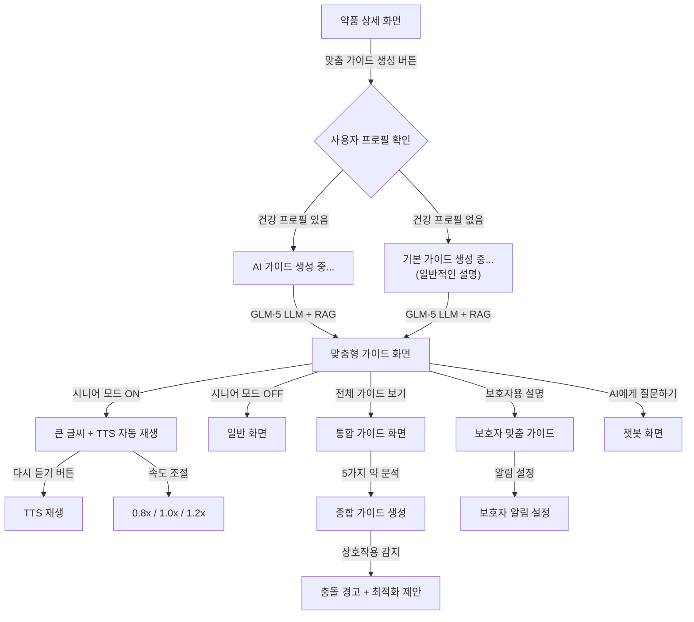
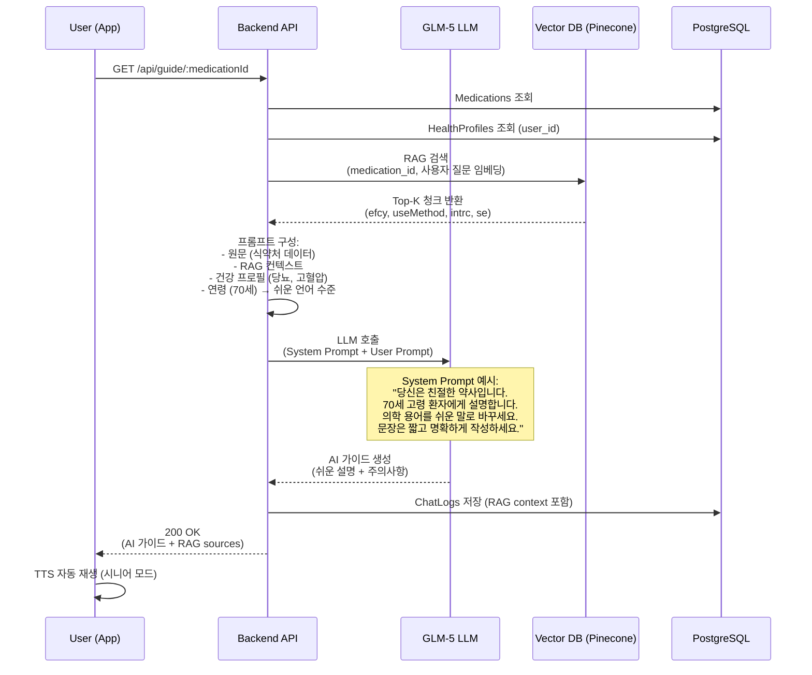

# 🔴 P0-3 — LLM 맞춤형 가이드 상세 명세

> 상위 문서: [[P0 - MVP 핵심기능]] | [[🏠 요약 - 프로젝트 홈]]

---

## 📋 기능 개요

| 항목 | 내용 |
|------|------|
| **기능명** | LLM 기반 맞춤형 복약 가이드 |
| **목표** | 의학 용어를 쉽게 번역·요약, 실버 모드 UI, TTS 자동 재생 |
| **사용자** | 환자 (특히 고령층), 보호자 |
| **우선순위** | P0 (MVP 필수) |
| **핵심 기술** | GLM-5 LLM, RAG (3단계), TTS (OS 내장) |
| **개인화 요소** | 건강 프로필, 연령, 언어 수준 |

---

## 🎯 사용자 시나리오

### 시나리오 1: 70세 고령 환자의 처방전 이해
```
김할머니(70세, 당뇨·고혈압 환자)가 병원에서 새로운 약을 처방받았습니다.
약 봉투의 복약지도문에는 어려운 의학 용어가 많습니다.

1. 요약 앱에서 처방전을 스캔합니다.
2. OCR로 약품 정보가 인식되고, "맞춤 가이드 생성" 버튼이 나타납니다.
3. 버튼을 탭하면 AI가 김할머니의 건강 프로필을 참고하여 가이드를 생성합니다:

   [원문 (식약처)]
   "본제는 안지오텐신 II 수용체 길항제로서 혈관을 확장시켜
   혈압을 낮추는 작용을 합니다..."

   [AI 쉬운 설명]
   "이 약은 혈압을 낮추는 약입니다.
   혈관을 넓혀서 혈액이 잘 흐르게 도와줍니다.
   아침에 식사 후 30분에 드세요.

   ⚠️ 주의하세요:
   - 어지러울 수 있으니 천천히 일어나세요
   - 이미 드시는 당뇨약과 함께 먹어도 괜찮습니다
   - 갑자기 끊으면 안 됩니다"

4. 화면이 나타나자마자 TTS로 자동 읽어줍니다.
5. 큰 글씨(36px)로 표시되고, 고대비 색상이 적용됩니다.
6. "다시 듣기" 버튼을 눌러 반복해서 청취합니다.
7. "속도 조절" (0.8배속, 1.0배속, 1.2배속) 가능.
```

### 시나리오 2: 복수 약물 복용자의 통합 가이드
```
박씨(65세)는 5가지 약을 동시에 복용 중입니다.
각 약의 복용법과 주의사항이 헷갈립니다.

1. 요약 앱의 "내 약" 목록에 5가지 약이 등록되어 있습니다.
2. "전체 가이드 보기" 버튼을 탭합니다.
3. AI가 5가지 약을 종합적으로 분석하여 통합 가이드를 생성합니다:

   "박님, 현재 5가지 약을 드시고 계십니다.

   📅 복용 스케줄:
   - 아침 식후 (8:30): 약 A, 약 B, 약 C
   - 저녁 식후 (19:30): 약 D
   - 잠자기 전 (22:00): 약 E

   ⚠️ 중요한 주의사항:
   - 약 A와 약 B는 함께 먹어도 괜찮습니다
   - 하지만 약 C는 2시간 간격을 두고 드세요 (→ 10:30으로 조정 권장)
   - 자몽주스는 피하세요 (약 D와 상호작용)

   💊 이런 증상이 있으면 바로 병원에 가세요:
   - 심한 어지러움, 호흡곤란, 발진"

4. 통합 가이드가 시니어 모드로 표시됩니다.
5. "스케줄 최적화" 버튼을 눌러 충돌 없는 복용 시간을 재설정합니다.
```

### 시나리오 3: 보호자를 위한 설명
```
홍길동(45세)이 어머니의 약에 대해 알고 싶습니다.

1. 요약 앱의 "가족 관리" → "어머니" 프로필로 이동.
2. 어머니가 복용 중인 "고지혈증약" 상세 화면으로 진입.
3. "보호자용 설명" 탭을 선택합니다.
4. AI가 보호자에게 맞춤형 가이드를 생성:

   "이 약은 어머니의 콜레스테롤 수치를 낮추는 약입니다.

   보호자님이 알아야 할 사항:
   - 매일 저녁 같은 시간에 드셔야 효과적입니다
   - 근육통이 생기면 바로 의사와 상담하세요
   - 자몽주스, 자몽은 피하게 도와주세요
   - 술을 드시면 간에 부담이 됩니다

   알림 설정:
   ☑ 어머니가 복용 안 했을 때 저에게도 알림 보내기
   ☑ 부작용 경고 발생 시 저에게도 알림 보내기"

5. 보호자는 전문 용어 설명도 확인할 수 있습니다 (접기/펼치기).
```

---

## 🖼️ 화면 플로우

### 화면 플로우 다이어그램


---

## 📱 화면 상세 명세

### 1. 맞춤형 가이드 화면

#### UI 요소

##### 상단 영역
- **약품 이미지 + 이름**: 큰 글씨 (시니어: 30px)
- **TTS 컨트롤**:
  - "들어보기" 버튼 (자동 재생 후에는 "다시 듣기")
  - 재생 중 표시: 🔊 아이콘 + 진행바
  - 일시정지 / 재개 버튼
  - 속도 조절: 0.8배속, 1.0배속 (기본), 1.2배속
  - 음량 조절: 슬라이더

##### 가이드 콘텐츠 (섹션별)
1. **이 약은 무엇인가요?** (efcyQesitm 기반)
   - 쉬운 언어로 효능 설명
   - 1~2 문장, 핵심만

2. **어떻게 먹나요?** (useMethodQesitm 기반)
   - 복용량, 횟수, 타이밍
   - 예: "하루 3번, 식사 후 30분에 1알씩 드세요"

3. **주의할 점** (intrcQesitm, atpnQesitm 기반)
   - ⚠️ 아이콘 + 경고 박스
   - 상호작용, 부작용 쉽게 설명
   - 예: "술을 마시면 간에 부담이 됩니다"

4. **이런 증상이 있으면 바로 병원에 가세요** (seQesitm 기반)
   - 🚨 아이콘 + 빨간색 경고 박스
   - 심각한 부작용만 선별
   - 예: "호흡곤란, 심한 발진, 얼굴 부기"

5. **보관 방법** (depositMethodQesitm 기반)
   - 간단하게 1문장
   - 예: "서늘한 곳에 보관하세요 (냉장고 ✗)"

##### 하단 액션 버튼
- "AI에게 질문하기" (챗봇으로 이동)
- "전체 가이드 보기" (원문 보기, 접기/펼치기)
- "인쇄하기" (PDF 저장)

##### 면책 문구 (고정)
- 화면 하단: "본 정보는 참고용이며, 의사·약사 상담을 대체하지 않습니다."

---

### 2. 시니어 모드 가이드 화면

#### 차별화 요소
- **폰트 크기**: 일반 대비 150%
  - 제목: 36px
  - 본문: 24px
  - 버튼: 26px
- **색상 대비**: WCAG AA 기준 이상
  - 배경: #FFFFFF (흰색) / 텍스트: #000000 (검정)
  - 경고 박스: #FFF3CD (노란 배경) / 텍스트: #856404 (진한 갈색)
- **버튼 크기**: 최소 60x60px (터치 영역 확보)
- **라인 간격**: 1.8 (읽기 쉽게)
- **TTS 자동 재생**: 화면 로드 즉시 재생 시작
- **진동 피드백**: 버튼 탭 시 햅틱 피드백

---

### 3. 통합 가이드 화면 (복수 약물)

#### UI 요소
- **약품 목록**: 접기/펼치기 아코디언
  - 각 약품마다 간략 설명 + 복용 시간
- **복용 스케줄 타임라인**:
  - 시간 순으로 시각화
  - 예:
    ```
    08:30  💊 약 A, 약 B  (식후)
    10:30  💊 약 C  (식후 2시간)
    19:30  💊 약 D  (저녁 식후)
    22:00  💊 약 E  (취침 전)
    ```
- **상호작용 경고 섹션** (2단계):
  - ⚠️ "약 A와 약 C는 2시간 간격을 두세요"
  - 🚨 "약 B와 자몽주스는 함께 먹지 마세요"
- **스케줄 최적화 제안** (5단계):
  - "약 C를 10:30으로 변경하면 충돌이 없습니다"
  - "최적화 적용" 버튼

---

### 4. 보호자용 가이드 화면

#### UI 요소
- **탭 전환**: "환자용" / "보호자용"
- **보호자 맞춤 콘텐츠**:
  - "이 약이 필요한 이유"
  - "관찰해야 할 부작용"
  - "응급 상황 대처법"
  - "복약 도움 팁"
- **알림 설정 토글**:
  - ☑ 환자가 복용 안 했을 때 알림받기
  - ☑ 부작용 경고 발생 시 알림받기
  - ☑ 약 떨어지기 3일 전 알림받기

---

## 🔄 프로세스 플로우

### 백엔드 처리 흐름 (3단계: RAG)


---

## 🧪 테스트 케이스

### 기능 테스트

#### TC-1: 시니어 모드 가이드 생성
**입력:**
- 사용자: 김할머니 (70세, 당뇨·고혈압)
- 약품: 타이레놀정 500mg
- 시니어 모드: ON

**예상 출력:**
```
💊 타이레놀정 500밀리그램

[TTS 자동 재생 시작]

이 약은 무엇인가요?
타이레놀은 열을 내리고 통증을 줄여주는 약입니다.
두통, 치통, 몸살 기운이 있을 때 드세요.

어떻게 먹나요?
한 번에 1알씩, 하루에 3~4번 드세요.
최소 4시간 간격을 두고 드세요.
하루에 8알(4000mg)을 넘으면 안 됩니다.

⚠️ 주의할 점
- 술을 마시면 간에 나쁩니다
- 다른 감기약과 함께 먹지 마세요
- 이미 드시는 당뇨약, 혈압약과는 함께 먹어도 괜찮습니다

🚨 이런 증상이 있으면 바로 병원에 가세요
- 소변 색이 진하게 변함
- 눈이나 피부가 노래짐
- 심한 구역질, 구토
```

**수용 기준:**
- [ ] 폰트 크기 36px (제목), 24px (본문)
- [ ] 화면 로드 즉시 TTS 자동 재생
- [ ] "다시 듣기" 버튼 제공
- [ ] 속도 조절 가능 (0.8x, 1.0x, 1.2x)
- [ ] 건강 프로필 (당뇨, 고혈압) 반영하여 "함께 먹어도 괜찮습니다" 안내

---

#### TC-2: 통합 가이드 (복수 약물, 2단계 상호작용)
**입력:**
- 사용자: 박씨 (65세)
- 약품 5가지:
  1. 타이레놀 (해열진통제)
  2. 아스피린 (항혈소판제)
  3. 혈압약 A
  4. 당뇨약 B
  5. 수면제 C

**예상 출력:**
```
📅 복용 스케줄
08:30  💊 아스피린, 혈압약 A, 당뇨약 B
14:30  💊 타이레놀 (필요 시)
22:00  💊 수면제 C

⚠️ 중요한 주의사항
- 타이레놀과 아스피린은 함께 먹으면 위장 출혈 위험이 있습니다
  → 최소 2시간 간격을 두세요
- 수면제는 술과 함께 먹으면 매우 위험합니다

💡 스케줄 최적화 제안
타이레놀을 10:30으로 변경하면 아스피린과 충돌하지 않습니다.
[최적화 적용] 버튼
```

**수용 기준:**
- [ ] 5가지 약 모두 분석
- [ ] InteractionMatrix 조회하여 상호작용 감지 (2단계)
- [ ] 충돌 경고 표시
- [ ] "스케줄 최적화" 제안 (5단계)
- [ ] 최적화 적용 시 `/api/schedules/optimize` 호출

---

#### TC-3: 보호자용 가이드
**입력:**
- 보호자: 홍길동 (45세)
- 환자: 어머니 (75세)
- 약품: 고지혈증약 (스타틴)

**예상 출력:**
```
[보호자용 설명 탭]

이 약이 필요한 이유
어머니의 콜레스테롤 수치가 높아서 드시는 약입니다.
꾸준히 드시면 심장병, 뇌졸중 예방에 도움이 됩니다.

관찰해야 할 부작용
- 근육통: "다리가 아프다"고 하시면 바로 병원에 가세요
- 소변 색 변화: 진한 갈색이면 위험 신호입니다
- 소화불량: 흔한 증상이지만, 심하면 의사와 상담하세요

복약 도움 팁
- 매일 저녁 같은 시간에 드시게 도와주세요 (예: 저녁 8시)
- 자몽주스는 피하게 도와주세요 (약 효과가 너무 강해짐)
- 알람을 설정해드려도 좋습니다

알림 설정
☑ 어머니가 복용 안 했을 때 저에게도 알림 보내기
☑ 부작용 경고 발생 시 저에게도 알림 보내기
☐ 약 떨어지기 3일 전 알림받기
```

**수용 기준:**
- [ ] 보호자 관점의 설명
- [ ] "관찰해야 할 부작용" 섹션
- [ ] "복약 도움 팁" 제공
- [ ] 알림 설정 토글 제공
- [ ] 설정 변경 시 FamilyRelations 테이블 업데이트

---

#### TC-4: RAG 컨텍스트 활용 (3단계)
**입력:**
- 약품: 타이레놀
- RAG 검색 결과:
  - Chunk 1 (efcy): "아세트아미노펜은 중추신경계에 작용하여..."
  - Chunk 2 (useMethod): "성인 1회 1~2정, 1일 3~4회, 4시간 간격..."
  - Chunk 3 (intrc): "알코올과 병용 시 간독성 위험 증가..."

**예상 출력:**
- RAG 검색으로 가져온 3개 청크를 컨텍스트로 활용
- LLM이 원문을 쉽게 번역:
  - "중추신경계에 작용" → "뇌에서 통증 신호를 차단"
  - "간독성 위험 증가" → "간에 부담이 됩니다"

**수용 기준:**
- [ ] RAGChunks 테이블에서 관련 청크 검색
- [ ] Top-K (K=5) 청크를 LLM 프롬프트에 포함
- [ ] ChatLogs에 `rag_context` 저장 (어떤 청크 사용했는지)
- [ ] API 응답에 `ragSources` 필드 포함 (출처 표시)

---

### 성능 테스트

#### PT-1: 응답 시간
- **목표**: 95% 요청이 3초 이내
- **측정**: API 호출 → 가이드 생성 완료
- **조건**: RAG 검색 + LLM 호출 포함

#### PT-2: TTS 지연 시간
- **목표**: 화면 로드 후 1초 이내 TTS 재생 시작
- **측정**: 가이드 렌더링 완료 → TTS 첫 음성 출력

---

## ⚠️ 에러 처리

| 에러 코드 | HTTP | 원인 | 사용자 메시지 | 액션 |
|-----------|------|------|---------------|------|
| `LLM_API_ERROR` | 502 | GLM-5 LLM 호출 실패 | "가이드를 생성할 수 없습니다. 잠시 후 다시 시도하세요." | 재시도 / 원문 보기 |
| `RAG_RETRIEVAL_FAILED` | 500 | Vector DB 검색 실패 | "일시적인 오류가 발생했습니다." | 재시도 / 기본 가이드 제공 |
| `LOW_CONFIDENCE_RESPONSE` | 422 | LLM 신뢰도 < 0.7 | "정확한 정보를 제공할 수 없습니다. 약사와 상담하세요." | 원문 보기 / 약사 상담 |
| `TTS_NOT_SUPPORTED` | 0 | OS TTS 미지원 | "음성 안내를 사용할 수 없습니다." | 텍스트로만 표시 |

---

## 📊 데이터 모델

### RAGChunks 테이블 (참조)
```sql
CREATE TABLE RAGChunks (
    chunk_id UUID PRIMARY KEY,
    medication_id UUID REFERENCES Medications(medication_id),
    source_field ENUM('efcy', 'use_method', 'intrc', 'se', 'atpn', 'deposit'),
    chunk_text TEXT NOT NULL,
    chunk_sequence INT,
    embedding_id VARCHAR(255),  -- Pinecone vector ID
    metadata JSONB,
    created_at TIMESTAMP DEFAULT CURRENT_TIMESTAMP
);
```

### ChatLogs 테이블 (참조)
```sql
CREATE TABLE ChatLogs (
    chat_id UUID PRIMARY KEY,
    user_id UUID NOT NULL REFERENCES Users(user_id),
    user_message TEXT NOT NULL,
    ai_response TEXT NOT NULL,
    rag_context JSONB,  -- 사용된 RAG 청크 메타데이터
    confidence_score FLOAT,
    model_version VARCHAR(50),
    created_at TIMESTAMP DEFAULT CURRENT_TIMESTAMP
);
```

---

## 🎨 디자인 가이드

### 시니어 모드 색상
- **배경**: #FFFFFF (순백색)
- **텍스트**: #000000 (순검정)
- **경고 (주의)**: #FFF3CD (배경) / #856404 (텍스트)
- **경고 (긴급)**: #F8D7DA (배경) / #721C24 (텍스트)

### 타이포그래피
- **제목 (시니어)**: Pretendard Bold, 36px, line-height 1.6
- **본문 (시니어)**: Pretendard Regular, 24px, line-height 1.8
- **버튼 (시니어)**: Pretendard SemiBold, 26px

### 아이콘
- **약품**: 💊
- **주의**: ⚠️
- **긴급**: 🚨
- **팁**: 💡
- **스피커**: 🔊
- **일시정지**: ⏸️
- **재생**: ▶️

---

## 🔗 관련 API

- `GET /api/guide/:medicationId` - 맞춤형 가이드 생성 (3단계 RAG)
- `POST /api/chat` - AI 챗봇 (다음 기능 P0-4)

자세한 API 명세는 [[API 명세서]] 참조

---

## 📚 관련 문서

- [[P0 - MVP 핵심기능]]
- [[P0-1 알약 식별 (Vision AI)]]
- [[P0-2 복약지도문 OCR]]
- [[API 명세서]]
- [[ERD - 데이터베이스 설계]]
- [[UI·UX 디자인 가이드]]

---

## ✅ 수용 기준 (Definition of Done)

- [ ] 가이드 생성 3초 이내
- [ ] 의학 용어를 쉬운 언어로 번역 (예: "중추신경계" → "뇌")
- [ ] 건강 프로필 반영 (당뇨, 고혈압 등 기저질환 고려)
- [ ] 연령 기반 언어 수준 조정 (70세 이상 → 더 쉽게)
- [ ] 시니어 모드: 폰트 크기 150%, 고대비 색상
- [ ] TTS 자동 재생 (시니어 모드 ON 시)
- [ ] "다시 듣기" 버튼 제공
- [ ] 속도 조절 (0.8x, 1.0x, 1.2x)
- [ ] 음량 조절 슬라이더
- [ ] 일시정지 / 재개 기능
- [ ] RAG 검색으로 Top-K 청크 활용 (3단계)
- [ ] ChatLogs에 RAG 컨텍스트 저장
- [ ] 통합 가이드 (복수 약물) 지원
- [ ] 상호작용 경고 표시 (2단계)
- [ ] 보호자용 설명 탭 제공
- [ ] 보호자 알림 설정 가능
- [ ] 모든 화면에 면책 문구 노출

---

*최종 수정: 2026-02-23 | 버전: v1.0 | 작성자: 기획자*
