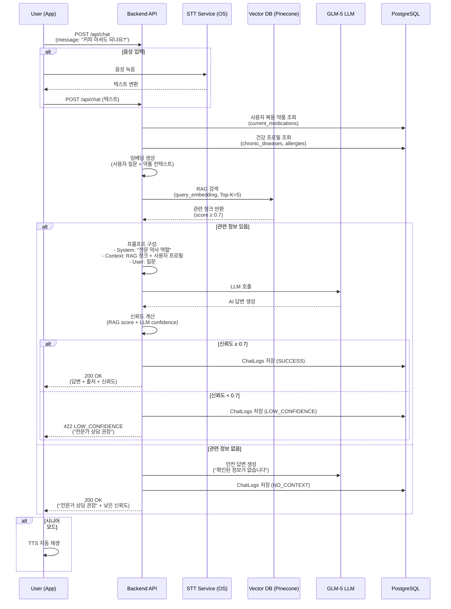

# 🔴 P0-4 — AI 챗봇 상담 (RAG 기반) 상세 명세

> 상위 문서: [[P0 - MVP 핵심기능]] | [[🏠 요약 - 프로젝트 홈]]

---

## 📋 기능 개요

| 항목 | 내용 |
|------|------|
| **기능명** | AI 챗봇 복약 상담 (RAG 기반) |
| **목표** | 전문 의약품 지식베이스 기반 정확·신뢰 높은 복약 Q&A |
| **사용자** | 환자, 보호자 |
| **우선순위** | P0 (MVP 필수) |
| **핵심 기술** | GLM-5 LLM, RAG (3단계), Vector DB (Pinecone/FAISS) |
| **지식베이스** | 약학정보원 KIMS, 식약처 e약은요, 내부 약품 DB |

---

## 🎯 사용자 시나리오

### 시나리오 1: 간단한 복약 질문
```
이영희(55세)가 타이레놀을 복용 중인데 궁금한 점이 생겼습니다.

1. 약품 상세 화면에서 "AI에게 질문하기" 버튼을 탭합니다.
2. 챗봇 화면이 열립니다.
3. 음성 또는 텍스트로 질문합니다:
   "이 약 먹고 커피 마셔도 되나요?"

4. AI가 3초 이내에 답변합니다:
   "타이레놀(아세트아미노펜)과 커피는 일반적으로 함께 복용해도 문제가 없습니다.
   오히려 커피의 카페인 성분이 진통 효과를 약간 높일 수 있습니다.

   다만, 과도한 카페인 섭취는 불안감이나 불면증을 유발할 수 있으니
   적당량(하루 2~3잔 이내)을 섭취하세요.

   📚 출처: 식약처 e약은요 - 타이레놀 상호작용 정보
   🔍 신뢰도: 92%

   ⚠️ 본 정보는 참고용이며, 의사·약사와 상담하세요."

5. 추가 질문을 이어서 할 수 있습니다 (대화 히스토리 유지).
```

### 시나리오 2: 복잡한 다중 약물 질문
```
박씨(65세)는 5가지 약을 복용 중이고, 새로운 약을 추가해야 합니다.

1. "내 약" 목록 화면에서 "AI 상담" 버튼을 탭합니다.
2. 음성으로 질문합니다:
   "지금 먹는 약에 아스피린을 추가해도 되나요?"

3. AI가 사용자의 복용 중인 약 5가지를 컨텍스트로 활용하여 답변:
   "현재 드시는 약 중 타이레놀과 아스피린은 함께 복용 시 주의가 필요합니다.

   ⚠️ 주요 상호작용:
   - 타이레놀 + 아스피린: 위장 출혈 위험 증가 가능
   - 혈압약 A + 아스피린: 신장 기능에 영향 가능

   💡 권장사항:
   1. 먼저 의사와 상담하세요
   2. 함께 복용해야 한다면:
      - 최소 2시간 간격을 두세요
      - 위장약을 함께 처방받는 것이 좋습니다

   🚨 이런 증상이 있으면 즉시 병원에 가세요:
   - 검은색 변, 토혈, 심한 복통

   📚 출처: 식약처 DUR 병용금기 정보, InteractionMatrix DB
   🔍 신뢰도: 95%"

4. "스케줄 최적화 제안받기" 버튼이 나타나고, 탭하면 충돌 없는 복약 시간을 제안합니다.
```

### 시나리오 3: 지식베이스에 없는 질문
```
김할머니(70세)가 엉뚱한 질문을 합니다.

1. 챗봇에 질문:
   "타이레놀 먹으면 키가 크나요?"

2. AI가 RAG 검색을 수행하지만 관련 정보를 찾지 못합니다.
3. 신뢰도가 낮아 안전한 답변을 생성:

   "죄송합니다. 타이레놀과 키 성장에 대한 관계는 확인된 의학 정보가 없습니다.

   타이레놀은 해열·진통제로, 일시적인 통증이나 발열을 완화하는 약입니다.

   더 정확한 정보가 필요하시면 의사나 약사와 상담해주세요.

   🔍 신뢰도: 30% (낮음 - 전문가 상담 권장)"

4. "약사와 상담하기" 버튼 표시.
```

### 시나리오 4: 시니어 모드 음성 대화
```
김할머니(70세)가 시니어 모드로 챗봇을 사용합니다.

1. 챗봇 화면에서 큰 마이크 버튼을 탭합니다.
2. 음성으로 질문:
   "이 약 부작용이 뭐예요?"

3. AI가 음성을 텍스트로 변환 (STT)하고, 답변을 생성합니다.
4. 텍스트 답변이 화면에 큰 글씨로 표시되고, TTS로 자동 읽어줍니다:

   [TTS 재생]
   "타이레놀의 주요 부작용은 다음과 같습니다.
   구역, 구토, 발진, 소화불량이 있을 수 있습니다.
   하지만 대부분 가볍고 일시적입니다.

   심각한 부작용은 드물지만, 이런 증상이 있으면 바로 병원에 가세요.
   소변 색이 진하게 변하거나, 눈이나 피부가 노래지면 위험합니다."

5. "다시 듣기" 버튼으로 반복 청취 가능.
6. "더 질문하기" 버튼으로 연속 대화 가능.
```

---

## 🖼️ 화면 플로우

### 화면 플로우 다이어그램
```mermaid
graph TD
    A[약품 상세 화면] -->|"AI에게 질문하기"| B[챗봇 화면]
    C[내 약 목록] -->|"AI 상담"| B
    D[홈 화면] -->|"복약 상담 챗봇"| B

    B -->|텍스트 입력| E[질문 전송]
    B -->|음성 입력| F[STT 변환]
    F --> E

    E -->|RAG 검색| G{지식베이스 검색}

    G -->|관련 정보 있음<br/>score ≥ 0.7| H[AI 답변 생성]
    G -->|관련 정보 없음<br/>score < 0.7| I[안전 답변 생성<br/>"전문가 상담 권장"]

    H -->|답변 표시| J[답변 화면]
    I -->|답변 표시| J

    J -->|시니어 모드 ON| K[TTS 자동 재생]
    J -->|시니어 모드 OFF| L[텍스트만 표시]

    J -->|"출처 보기"| M[RAG 소스 표시]
    J -->|"더 질문하기"| B
    J -->|"약사 상담하기"| N[약사 연결]
    J -->|"스케줄 최적화"| O[최적화 제안]

    K -->|"다시 듣기"| K
```

---

## 📱 화면 상세 명세

### 1. 챗봇 화면 (메인)

#### UI 요소

##### 상단 영역
- **헤더**:
  - 타이틀: "복약 상담 AI" 또는 "약품명 + AI 상담"
  - 닫기 버튼
  - 설정 버튼 (음성 속도, 언어 수준)

##### 대화 영역 (중앙, 스크롤 가능)
- **사용자 메시지 (우측 정렬)**:
  - 배경: #007AFF (파란색)
  - 텍스트: 흰색
  - 꼬리: 우측 하단

- **AI 답변 (좌측 정렬)**:
  - 배경: #F0F0F0 (연회색)
  - 텍스트: 검정
  - 꼬리: 좌측 하단

  **AI 답변 구조:**
  ```
  [AI 아이콘] AI 약사

  타이레놀과 커피는 일반적으로 함께 복용해도 문제가 없습니다.
  오히려 커피의 카페인 성분이 진통 효과를 약간 높일 수 있습니다...

  📚 출처: 식약처 e약은요
  🔍 신뢰도: 92%

  [출처 보기] [다시 듣기] [도움이 됐나요? 👍 👎]
  ```

##### 하단 입력 영역
- **텍스트 입력 필드**:
  - Placeholder: "복약에 대해 질문하세요..."
  - 자동완성 제안 (예: "이 약 부작용은?", "커피 마셔도 되나요?")

- **음성 입력 버튼**:
  - 마이크 아이콘 🎤
  - 탭하면 STT 시작
  - 녹음 중: 빨간색 펄스 애니메이션

- **전송 버튼**:
  - 텍스트 있을 때만 활성화
  - 비행기 아이콘 ✈️

##### 시니어 모드 차이점
- **폰트 크기**: 24px (일반) → 32px (시니어)
- **버튼 크기**: 44x44px → 60x60px
- **음성 입력**: 기본 활성화
- **TTS**: 답변 자동 읽기

---

### 2. 음성 입력 화면 (STT)

#### UI 요소
- **음파 애니메이션**: 중앙, 실시간 음성 입력 시각화
- **인식된 텍스트**: 하단, 실시간 표시
- **취소 버튼**: 좌측 하단
- **완료 버튼**: 우측 하단 (텍스트 있을 때만)

#### 안내 메시지
- "질문을 말씀해주세요..."
- 인식 중: "듣고 있습니다..."
- 완료: "질문을 확인하세요"

---

### 3. 답변 로딩 화면

#### UI 요소
- **로딩 스피너**: 좌측 (AI 아이콘 위치)
- **진행 텍스트**:
  1. "관련 정보를 찾고 있습니다..." (RAG 검색)
  2. "답변을 작성하고 있습니다..." (LLM 생성)
- **취소 버튼**: "취소"

#### 타임아웃
- **5초**: 95% 요청 목표
- **10초**: 타임아웃

---

### 4. 답변 상세 화면

#### 신뢰도별 UI 분기
| 신뢰도 | 배지 | 안내 |
|--------|------|------|
| ≥ 0.9 | 🟢 높음 | "신뢰할 수 있는 답변입니다" |
| 0.7 ~ 0.9 | 🟡 중간 | "참고용으로 활용하세요" |
| < 0.7 | 🔴 낮음 | "전문가 상담이 필요합니다" |

#### 출처 표시 (접기/펼치기)
```
📚 이 답변의 출처:
- 식약처 e약은요: 타이레놀 상호작용 (신뢰도 95%)
- 약학정보원 KIMS: 아세트아미노펜-카페인 (신뢰도 88%)
- 내부 RAG DB: Chunk #12345 (신뢰도 82%)
```

#### 액션 버튼
- **출처 보기**: RAG 소스 모달
- **다시 듣기**: TTS 재생 (시니어 모드)
- **도움이 됐나요?**: 👍 👎 (피드백 수집)
- **스케줄 최적화**: 상호작용 감지 시에만 표시
- **약사와 상담하기**: 신뢰도 낮을 때 표시

---

### 5. 대화 히스토리

#### UI 요소
- **날짜별 그룹화**: "오늘", "어제", "지난주"
- **각 대화 항목**:
  - 첫 질문 텍스트 (1줄)
  - 시간: "2시간 전"
  - 탭하면 전체 대화 보기
- **검색 기능**: 이전 질문 검색
- **삭제 기능**: 스와이프 삭제

---

## 🔄 프로세스 플로우

### 백엔드 처리 흐름 (RAG)


---

## 🧪 테스트 케이스

### 기능 테스트

#### TC-1: 기본 질문 (높은 신뢰도)
**입력:**
- 사용자: 이영희 (타이레놀 복용 중)
- 질문: "이 약 먹고 커피 마셔도 되나요?"

**예상 RAG 검색 결과:**
- Chunk 1 (intrcQesitm): "카페인 함유 음료와 병용 시..." (score: 0.92)
- Chunk 2 (KIMS DB): "아세트아미노펜-카페인 상호작용..." (score: 0.85)

**예상 출력:**
```
타이레놀(아세트아미노펜)과 커피는 일반적으로 함께 복용해도 문제가 없습니다.
오히려 커피의 카페인 성분이 진통 효과를 약간 높일 수 있습니다.

다만, 과도한 카페인 섭취는 불안감이나 불면증을 유발할 수 있으니
적당량(하루 2~3잔 이내)을 섭취하세요.

📚 출처: 식약처 e약은요, 약학정보원 KIMS
🔍 신뢰도: 92%
```

**수용 기준:**
- [ ] 5초 이내 답변 생성
- [ ] RAG 검색으로 관련 청크 2개 이상 활용
- [ ] 신뢰도 ≥ 0.9
- [ ] 출처 표시
- [ ] ChatLogs에 RAG context 저장

---

#### TC-2: 복잡한 다중 약물 질문 (2단계 통합)
**입력:**
- 사용자: 박씨 (타이레놀, 아스피린, 혈압약 복용 중)
- 질문: "지금 먹는 약에 새로운 약을 추가해도 되나요?"

**예상 출력:**
```
현재 드시는 약 중 타이레놀과 아스피린은 함께 복용 시 주의가 필요합니다.

⚠️ 주요 상호작용:
- 타이레놀 + 아스피린: 위장 출혈 위험 증가 가능
- 혈압약 + 아스피린: 신장 기능에 영향 가능

💡 권장사항:
1. 먼저 의사와 상담하세요
2. 함께 복용해야 한다면 최소 2시간 간격을 두세요

🚨 이런 증상이 있으면 즉시 병원에 가세요:
- 검은색 변, 토혈, 심한 복통

📚 출처: InteractionMatrix DB, 식약처 DUR
🔍 신뢰도: 95%

[스케줄 최적화 제안받기]
```

**수용 기준:**
- [ ] 사용자의 복용 중인 약 3개 모두 컨텍스트로 활용
- [ ] InteractionMatrix 테이블 조회 (2단계)
- [ ] 상호작용 경고 표시
- [ ] "스케줄 최적화" 버튼 제공 (5단계 연계)

---

#### TC-3: 지식베이스에 없는 질문 (낮은 신뢰도)
**입력:**
- 질문: "타이레놀 먹으면 키가 크나요?"

**예상 RAG 검색 결과:**
- (관련 정보 없음, score < 0.5)

**예상 출력:**
```
죄송합니다. 타이레놀과 키 성장에 대한 관계는 확인된 의학 정보가 없습니다.

타이레놀은 해열·진통제로, 일시적인 통증이나 발열을 완화하는 약입니다.

더 정확한 정보가 필요하시면 의사나 약사와 상담해주세요.

🔍 신뢰도: 30% (낮음 - 전문가 상담 권장)

[약사와 상담하기]
```

**수용 기준:**
- [ ] RAG 검색 결과 없음
- [ ] 안전한 기본 답변 생성
- [ ] 신뢰도 < 0.5
- [ ] "약사와 상담하기" 버튼 표시
- [ ] 잘못된 정보 제공하지 않음

---

#### TC-4: 시니어 모드 음성 대화
**입력:**
- 사용자: 김할머니 (70세, 시니어 모드 ON)
- 음성 질문: "이 약 부작용이 뭐예요?"

**예상 출력:**
- 텍스트 답변 화면 표시 (큰 글씨 32px)
- TTS 자동 재생:
  ```
  타이레놀의 주요 부작용은 다음과 같습니다.
  구역, 구토, 발진, 소화불량이 있을 수 있습니다.
  하지만 대부분 가볍고 일시적입니다.

  심각한 부작용은 드물지만, 이런 증상이 있으면 바로 병원에 가세요.
  소변 색이 진하게 변하거나, 눈이나 피부가 노래지면 위험합니다.
  ```

**수용 기준:**
- [ ] STT로 음성 인식
- [ ] 답변 생성 후 TTS 자동 재생
- [ ] 큰 글씨 (32px)
- [ ] "다시 듣기" 버튼 제공
- [ ] 속도 조절 가능

---

#### TC-5: 대화 히스토리 유지
**입력:**
- 1차 질문: "타이레놀은 무엇인가요?"
- 2차 질문: "이 약 부작용은요?" (대명사 사용)

**예상 출력:**
- AI가 이전 대화 컨텍스트를 유지하여 "이 약 = 타이레놀"로 이해
- 타이레놀 부작용 답변 생성

**수용 기준:**
- [ ] 대화 히스토리 유지 (최대 10턴)
- [ ] 대명사 해석 정확
- [ ] ChatLogs에 대화 시퀀스 저장

---

### 성능 테스트

#### PT-1: 응답 시간
- **목표**: 95% 요청이 5초 이내
- **측정**: 질문 전송 → 답변 표시
- **조건**: RAG 검색 + LLM 호출 포함

#### PT-2: RAG 검색 정확도
- **목표**: Top-5 청크 중 관련 정보 포함률 95% 이상
- **테스트 세트**: 100개 질문
- **측정**: 관련 청크가 Top-5 안에 포함되는지

---

## ⚠️ 에러 처리

| 에러 코드 | HTTP | 원인 | 사용자 메시지 | 액션 |
|-----------|------|------|---------------|------|
| `RAG_RETRIEVAL_FAILED` | 500 | Vector DB 검색 실패 | "일시적인 오류가 발생했습니다. 다시 시도하세요." | 재시도 |
| `LLM_API_ERROR` | 502 | GLM-5 LLM 호출 실패 | "답변을 생성할 수 없습니다. 잠시 후 다시 시도하세요." | 재시도 |
| `LOW_CONFIDENCE_RESPONSE` | 422 | 신뢰도 < 0.7 | "정확한 정보를 제공할 수 없습니다. 약사와 상담하세요." | 약사 상담 |
| `STT_FAILED` | 0 | 음성 인식 실패 | "음성을 인식할 수 없습니다. 다시 말씀해주세요." | 재녹음 / 텍스트 입력 |
| `TIMEOUT` | 408 | 처리 시간 > 10초 | "처리 시간이 초과되었습니다. 다시 시도하세요." | 재시도 |

---

## 📊 데이터 모델

### ChatLogs 테이블 (참조)
```sql
CREATE TABLE ChatLogs (
    chat_id UUID PRIMARY KEY,
    user_id UUID NOT NULL REFERENCES Users(user_id),
    user_message TEXT NOT NULL,
    ai_response TEXT NOT NULL,
    rag_context JSONB,  -- 사용된 RAG 청크
    confidence_score FLOAT,
    model_version VARCHAR(50),
    response_time_ms INT,
    created_at TIMESTAMP DEFAULT CURRENT_TIMESTAMP
);
```

**rag_context 예시:**
```json
{
  "chunks": [
    {
      "chunk_id": "uuid-1",
      "source_field": "intrc",
      "snippet": "카페인 함유 음료와 병용 시...",
      "score": 0.92,
      "medication_name": "타이레놀정500밀리그램"
    },
    {
      "chunk_id": "uuid-2",
      "source_field": "se",
      "snippet": "주요 부작용: 구역, 구토...",
      "score": 0.85,
      "medication_name": "타이레놀정500밀리그램"
    }
  ],
  "total_retrieved": 5,
  "search_method": "semantic_search"
}
```

---

## 🎨 디자인 가이드

### 말풍선 스타일
- **사용자 메시지**: #007AFF (iOS Blue)
- **AI 메시지**: #F0F0F0 (연회색)
- **경고 메시지**: #FFF3CD (노란 배경)
- **에러 메시지**: #F8D7DA (빨간 배경)

### 아이콘
- **AI**: 🤖 또는 💊
- **출처**: 📚
- **신뢰도**: 🔍
- **경고**: ⚠️
- **긴급**: 🚨
- **팁**: 💡
- **마이크**: 🎤
- **스피커**: 🔊

---

## 🔗 관련 API

- `POST /api/chat` - AI 챗봇 대화
- `GET /api/chat/history` - 대화 히스토리 조회

자세한 API 명세는 [[API 명세서]] 참조

---

## 📚 관련 문서

- [[P0 - MVP 핵심기능]]
- [[P0-3 LLM 맞춤형 가이드]]
- [[API 명세서]]
- [[ERD - 데이터베이스 설계]]

---

## ✅ 수용 기준 (Definition of Done)

- [ ] 질문 후 5초 이내 답변 생성 (95% 요청)
- [ ] RAG 검색으로 Top-K 청크 활용 (3단계)
- [ ] 지식베이스에 없는 질문은 "전문가 상담 권장" 안내
- [ ] 모든 답변 하단에 면책 조항 노출
- [ ] 신뢰도 표시 (0~100%)
- [ ] 출처 표시 (RAG 소스)
- [ ] 음성 입력 (STT) 지원
- [ ] 시니어 모드: TTS 자동 재생
- [ ] "다시 듣기" 버튼 제공
- [ ] 대화 히스토리 유지 (최대 10턴)
- [ ] InteractionMatrix 조회하여 상호작용 경고 (2단계)
- [ ] "스케줄 최적화" 버튼 제공 (상호작용 감지 시)
- [ ] 피드백 수집 (👍 👎)
- [ ] ChatLogs에 RAG 컨텍스트 저장
- [ ] 에러 처리 (RAG 실패, LLM 실패, 타임아웃)

---

*최종 수정: 2026-02-23 | 버전: v1.0 | 작성자: 기획자*
