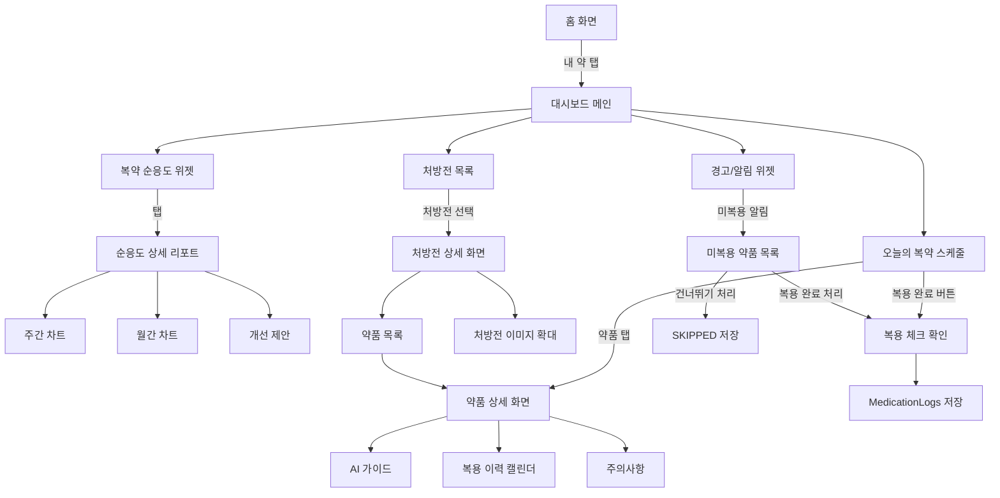
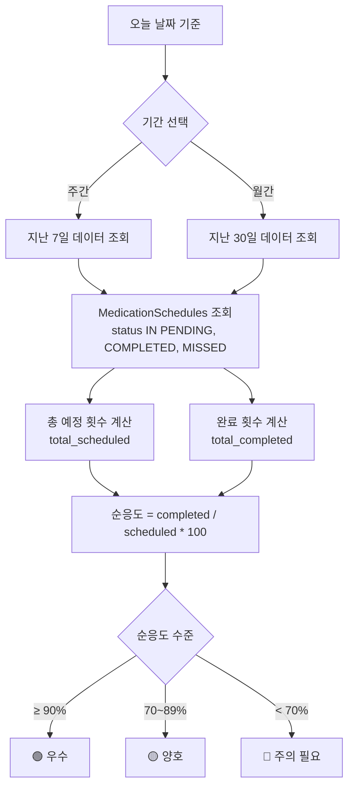

# 🔴 P0-5 — 복약 기록 관리 대시보드 상세 명세

> 상위 문서: [[P0 - MVP 핵심기능]] | [[🏠 요약 - 프로젝트 홈]]

---

## 📋 기능 개요

| 항목 | 내용 |
|------|------|
| **기능명** | 복약 기록 관리 대시보드 |
| **목표** | 스캔·전송받은 처방전·알약 이력 저장 및 관리, 복약 순응도 트래킹 |
| **사용자** | 환자, 보호자 |
| **우선순위** | P0 (MVP 필수) |
| **핵심 기능** | 처방전 이력, 복약 스케줄, 순응도 리포트 |

---

## 🎯 사용자 시나리오

### 시나리오 1: 환자의 복약 기록 확인
```
이영희(55세)가 자신의 복약 기록을 확인하려고 합니다.

1. 요약 앱 홈 화면의 "내 약" 탭을 탭합니다.
2. 대시보드가 나타납니다:

   📊 이번 주 복약 순응도
   ████████░░ 80% (20/25회)

   📅 오늘의 복약 (2026-02-23)
   ✅ 08:30  타이레놀정 500mg (완료)
   ⏰ 13:30  타이레놀정 500mg (예정)
   ⏰ 19:30  타이레놀정 500mg (예정)
   ✅ 22:00  수면제 (완료)

   📋 처방전 목록
   🏥 2026-02-20  서울대병원 (3가지 약)
   🏥 2026-02-15  강남약국 (2가지 약)
   ...

3. "이번 주 복약 순응도"를 탭하면 상세 리포트가 나타납니다:
   - 주간 차트 (막대 그래프)
   - 월요일: 100% (5/5)
   - 화요일: 60% (3/5)
   - 수요일: 100% (5/5)
   - ...

4. "처방전 목록"에서 하나를 탭하면:
   - 처방전 이미지 (확대 가능)
   - 약품 상세 정보
   - 복약 기록 (날짜별)

5. 개별 약품을 탭하면:
   - 복용 이력 캘린더
   - AI 가이드
   - 주의사항
```

### 시나리오 2: 보호자가 부모님 복약 기록 확인
```
홍길동(45세)이 어머니의 복약 상황을 확인합니다.

1. "가족 관리" 탭으로 이동합니다.
2. "어머니 (홍부모)" 프로필을 선택합니다.
3. 어머니의 대시보드가 나타납니다:

   📊 이번 주 복약 순응도
   ████░░░░░░ 40% (10/25회)  ⚠️ 주의 필요

   🚨 미복용 알림 (3건)
   - 어제 19:30  타이레놀정 (미복용)
   - 오늘 08:30  혈압약 (미복용)
   - 오늘 13:30  타이레놀정 (미복용)

   📞 어머니께 전화하기 버튼

4. 홍길동은 어머니께 전화하여 복약을 안내합니다.
5. 어머니가 약을 복용하면, 홍길동이 대신 "복용 완료" 버튼을 탭합니다.
6. 어머니의 순응도가 48%로 업데이트됩니다.
```

### 시나리오 3: 복약 순응도 주간 리포트 자동 생성
```
매주 일요일 저녁 8시, 이영희에게 푸시 알림이 옵니다.

"이번 주 복약 순응도: 80% (20/25회)
지난주보다 10% 향상되었습니다! 👍

미복용:
- 화요일 13:30 타이레놀 (까먹음)
- ...

다음 주도 화이팅하세요!"

이영희는 알림을 탭하여 상세 리포트를 확인합니다:
- 주간 트렌드 그래프
- 요일별 순응도
- 자주 놓치는 시간대 분석
- 개선 제안: "점심 복약이 자주 누락됩니다. 알람 시간을 변경하시겠어요?"
```

---

## 🖼️ 화면 플로우

### 화면 플로우 다이어그램


---

## 📱 화면 상세 명세

### 1. 대시보드 메인 화면

#### UI 요소

##### 상단: 요약 카드
```
┌─────────────────────────────────┐
│  📊 이번 주 복약 순응도          │
│  ████████░░ 80% (20/25회)       │
│  지난주 대비 +10% ↑              │
│  [상세 보기]                     │
└─────────────────────────────────┘
```

##### 오늘의 복약 섹션
```
📅 오늘의 복약 (2026-02-23)

┌─────────────────────────────────┐
│ ✅ 08:30  타이레놀정 500mg       │
│          완료 (08:32)            │
│          [다시 보기]             │
├─────────────────────────────────┤
│ ⏰ 13:30  타이레놀정 500mg       │
│          1회 1정, 식후 30분      │
│          [복용 완료] [건너뛰기]  │
├─────────────────────────────────┤
│ ⏰ 19:30  타이레놀정 500mg       │
│          예정                    │
└─────────────────────────────────┘
```

**상태 표시:**
- ✅ 완료 (COMPLETED): 녹색
- ⏰ 예정 (PENDING): 파란색
- ❌ 미복용 (MISSED): 빨간색
- ⏭️ 건너뛰기 (SKIPPED): 회색

##### 경고/알림 위젯 (조건부 표시)
```
🚨 미복용 알림 (3건)
어제 19:30  타이레놀정 (미복용)
오늘 08:30  혈압약 (미복용)

[모두 보기]
```

##### 처방전 목록
```
📋 처방전 이력

┌───────────────────────────┐
│ 🏥 2026-02-20             │
│ 서울대학교병원            │
│ 타이레놀정, 아스피린 외 1개│
│ [자세히 보기]             │
├───────────────────────────┤
│ 🏥 2026-02-15             │
│ 강남약국 (약사 전송)       │
│ 혈압약 외 1개             │
│ [자세히 보기]             │
└───────────────────────────┘

[+ 새 처방전 추가]
```

##### 하단 탭바
- "홈" 🏠
- "내 약" 💊 (현재)
- "경고" ⚠️
- "챗봇" 💬
- "더보기" ⋯

---

### 2. 복약 순응도 상세 리포트 화면

#### UI 요소

##### 기간 선택 탭
- "주간" (기본)
- "월간"
- "전체"

##### 주간 차트 (막대 그래프)
```
100%│       ██
    │   ██  ██  ██
 80%│   ██  ██  ██  ██
    │   ██  ██  ██  ██
 60%│   ██  ██  ██  ██  ██
    │   ██  ██  ██  ██  ██
 40%│   ██  ██  ██  ██  ██
    │   ██  ██  ██  ██  ██  ██
  0%└───────────────────────────
     월  화  수  목  금  토  일

이번 주 평균: 80%
지난주 평균: 70% (+10% 개선!)
```

##### 통계 카드
```
┌──────────────┬──────────────┐
│ 총 복용 횟수  │ 총 처방 횟수 │
│    20회      │    25회      │
├──────────────┼──────────────┤
│ 미복용       │ 건너뛰기     │
│    4회       │    1회       │
└──────────────┴──────────────┘
```

##### 시간대별 분석
```
🕐 자주 놓치는 시간대:
- 점심 (13:00~14:00): 3회 누락
- 저녁 (19:00~20:00): 1회 누락

💡 개선 제안:
점심 시간 알람을 12:30으로 앞당기시겠어요?
[알람 조정]
```

##### 월간 캘린더
```
2월 2026
일  월  화  수  목  금  토
                1   2   3
    ✅  ⚠️  ✅  ✅  ✅  ✅
4   5   6   7   8   9   10
✅  ✅  ✅  ❌  ✅  ✅  ✅
...

✅ 100% 복용  ⚠️ 80% 이상  ❌ 80% 미만
```

---

### 3. 처방전 상세 화면

#### UI 요소

##### 처방전 이미지
- 전체 화면 이미지 (확대/축소 가능)
- 썸네일 → 탭하면 확대

##### 처방 정보
```
🏥 병원명: 서울대학교병원
📅 처방일: 2026-02-20
👨‍⚕️ 의사: 홍길동
💊 약국: 서울약국 (조제)
```

##### 약품 목록
```
💊 처방 약품 (3가지)

┌─────────────────────────────────┐
│ 타이레놀정 500mg                │
│ 1회 1정, 1일 3회, 식후 30분      │
│ 7일분                           │
│ [상세 보기] [AI 가이드]          │
├─────────────────────────────────┤
│ 아스피린장용정 100mg             │
│ 1회 1정, 1일 1회, 아침 식후      │
│ 30일분                          │
│ [상세 보기] [AI 가이드]          │
└─────────────────────────────────┘
```

##### 액션 버튼
- "스케줄 생성" (아직 생성 안 했을 경우)
- "스케줄 수정"
- "처방전 삭제"
- "인쇄/공유"

---

### 4. 약품 상세 화면

#### UI 요소

##### 약품 정보 헤더
```
💊 타이레놀정 500mg
[약품 이미지]

제조사: 한국얀센
성분: 아세트아미노펜

[AI 가이드 보기]
```

##### 복용법
```
📋 복용 방법
1회 1정, 1일 3회, 식후 30분
복용 기간: 2026-02-20 ~ 2026-02-26 (7일)
```

##### 복용 이력 캘린더
```
2월 2026 - 타이레놀정 복용 이력

일  월  화  수  목  금  토
...
20  21  22  23  24  25  26
3/3 3/3 2/3 1/3  -   -   -

✅ 3/3: 모두 복용
⚠️ 2/3: 일부 누락
❌ 0/3: 전혀 복용 안 함
```

##### 주의사항 (접기/펼치기)
```
⚠️ 주의사항
- 하루 최대 8정(4000mg) 초과 금지
- 음주 시 간 손상 위험
- 다른 해열진통제와 병용 금지

🚨 이런 증상이 있으면 병원에 가세요
- 소변 색이 진함
- 눈·피부가 노래짐
- 심한 구역·구토
```

##### 하단 버튼
- "지금 복용했어요" (즉시 복용 기록)
- "AI에게 질문하기"
- "알람 설정"

---

### 5. 복용 체크 확인 모달

#### UI 요소 (Bottom Sheet)
```
┌─────────────────────────────────┐
│ 💊 타이레놀정 500mg             │
│ 복용하셨나요?                   │
│                                 │
│ [지금 복용했어요]               │
│ (2026-02-23 13:35)              │
│                                 │
│ [나중에 복용 (지연)]            │
│                                 │
│ [건너뛰기]                      │
│ (사유: ▼ 선택)                  │
│  - 까먹음                       │
│  - 부작용 있어서                │
│  - 약이 없어서                  │
│  - 기타                         │
│                                 │
│ 메모 (선택):                    │
│ [_____________________]         │
│                                 │
│ [취소]           [확인]         │
└─────────────────────────────────┘
```

**건너뛰기 사유 선택 시:**
- 보호자에게도 알림 전송 (설정된 경우)
- MedicationLogs에 `action: SKIPPED`, `note: "까먹음"` 저장

---

## 🔄 프로세스 플로우

### 복약 순응도 계산 로직


---

## 🧪 테스트 케이스

### 기능 테스트

#### TC-1: 대시보드 메인 화면 로드
**입력:**
- 사용자: 이영희 (타이레놀 3회/일, 수면제 1회/일 복용 중)
- 기간: 2026-02-17 ~ 2026-02-23 (지난 7일)

**예상 출력:**
```
📊 이번 주 복약 순응도
████████░░ 80% (20/25회)
지난주 대비 +10% ↑

📅 오늘의 복약 (2026-02-23)
✅ 08:30  타이레놀정 500mg (완료)
⏰ 13:30  타이레놀정 500mg (예정)
⏰ 19:30  타이레놀정 500mg (예정)
✅ 22:00  수면제 (완료)
```

**수용 기준:**
- [ ] 지난 7일 스케줄 조회 (총 28회: 타이레놀 21회 + 수면제 7회)
- [ ] 실제 완료 건수 계산 (20회)
- [ ] 순응도 = 20/25*100 = 80% (수면제 3일 미복용 가정)
- [ ] 지난주 순응도와 비교 (+10%)

---

#### TC-2: 복약 완료 처리
**입력:**
- 사용자가 "복용 완료" 버튼 클릭
- 약품: 타이레놀정 500mg
- 예정 시간: 13:30
- 실제 시간: 13:35

**예상 출력:**
- MedicationSchedules: `status` = COMPLETED, `actual_time` = 13:35
- MedicationLogs 생성:
  ```json
  {
    "action": "TAKEN",
    "taken_at": "2026-02-23T13:35:00Z",
    "noted_by": "user_id",
    "note": null
  }
  ```
- 화면에 "복용 완료했습니다 ✅" 토스트 메시지

**수용 기준:**
- [ ] MedicationSchedules 업데이트
- [ ] MedicationLogs 생성
- [ ] 순응도 즉시 업데이트 (80% → 84%)
- [ ] 보호자에게 알림 전송 (설정 시)

---

#### TC-3: 보호자가 환자 대신 복용 기록
**입력:**
- 보호자: 홍길동
- 환자: 어머니 (홍부모)
- 어머니가 약을 복용했지만, 앱에 기록하지 못함
- 홍길동이 "가족 관리" → "어머니" → "복용 완료" 클릭

**예상 출력:**
- MedicationSchedules: `status` = COMPLETED
- MedicationLogs:
  ```json
  {
    "user_id": "mother_id",
    "noted_by": "son_id",  // 보호자
    "action": "TAKEN",
    "note": "자녀가 대신 기록"
  }
  ```
- GuardianActions 로그:
  ```json
  {
    "action_type": "MARK_TAKEN",
    "guardian_id": "son_id",
    "patient_id": "mother_id"
  }
  ```

**수용 기준:**
- [ ] 보호자가 환자 대신 기록 가능
- [ ] `noted_by` 필드로 누가 기록했는지 추적
- [ ] GuardianActions에 감사 로그 저장
- [ ] 어머니 앱에 알림: "자녀(홍길동)님이 복약 기록을 추가했습니다"

---

#### TC-4: 순응도 주간 리포트 자동 생성
**입력:**
- 매주 일요일 20:00 (크론 작업)
- 사용자: 이영희

**예상 출력:**
- 푸시 알림:
  ```
  📊 이번 주 복약 순응도: 80%
  지난주보다 10% 향상! 👍

  미복용: 화요일 13:30 타이레놀 외 4건

  다음 주도 화이팅하세요!
  ```
- 알림 탭 시 → 순응도 상세 리포트 화면으로 이동

**수용 기준:**
- [ ] 매주 일요일 20:00 크론 작업 실행
- [ ] 모든 활성 사용자에게 리포트 생성
- [ ] 푸시 알림 전송 (FCM/APNS)
- [ ] 리포트 화면으로 딥링크

---

#### TC-5: 처방전 삭제
**입력:**
- 사용자가 처방전 상세 화면에서 "삭제" 버튼 클릭
- 확인 모달: "정말 삭제하시겠습니까?"
- 사용자가 "확인" 클릭

**예상 출력:**
- Prescriptions: `deleted_at` = CURRENT_TIMESTAMP (소프트 삭제)
- 연관 PrescriptionItems, MedicationSchedules도 비활성화
- 대시보드에서 처방전 목록에서 제거

**수용 기준:**
- [ ] 소프트 삭제 (실제 삭제 아님, `deleted_at` 필드)
- [ ] 연관 데이터도 함께 비활성화
- [ ] 삭제 후 "처방전이 삭제되었습니다" 토스트

---

## ⚠️ 에러 처리

| 에러 코드 | HTTP | 원인 | 사용자 메시지 | 액션 |
|-----------|------|------|---------------|------|
| `NO_PRESCRIPTIONS` | 404 | 처방전 없음 | "등록된 처방전이 없습니다. 새 처방전을 추가하세요." | "+ 새 처방전 추가" 버튼 |
| `NO_SCHEDULES_TODAY` | 404 | 오늘 스케줄 없음 | "오늘 복용할 약이 없습니다." | 안내 메시지만 표시 |
| `UPDATE_FAILED` | 500 | DB 업데이트 실패 | "복용 기록을 저장할 수 없습니다. 다시 시도하세요." | 재시도 |

---

## 📊 데이터 모델

### MedicationSchedules 테이블 (참조)
```sql
CREATE TABLE MedicationSchedules (
    schedule_id UUID PRIMARY KEY,
    prescription_item_id UUID NOT NULL,
    user_id UUID NOT NULL,
    created_by UUID NOT NULL,  -- 보호자 가능
    scheduled_time TIMESTAMP NOT NULL,
    actual_time TIMESTAMP,  -- 실제 복용 시간
    status ENUM('PENDING', 'COMPLETED', 'MISSED', 'CANCELLED'),
    created_at TIMESTAMP DEFAULT CURRENT_TIMESTAMP
);
```

### MedicationLogs 테이블 (참조)
```sql
CREATE TABLE MedicationLogs (
    log_id UUID PRIMARY KEY,
    schedule_id UUID NOT NULL,
    user_id UUID NOT NULL,
    noted_by UUID NOT NULL,  -- 기록자
    action ENUM('TAKEN', 'SKIPPED', 'DELAYED'),
    note TEXT,
    taken_at TIMESTAMP,
    created_at TIMESTAMP DEFAULT CURRENT_TIMESTAMP
);
```

---

## 🎨 디자인 가이드

### 순응도 색상
- **우수 (≥90%)**: #4CAF50 (녹색)
- **양호 (70-89%)**: #FF9800 (주황)
- **주의 (< 70%)**: #F44336 (빨강)

### 상태 아이콘
- ✅ 완료: #4CAF50
- ⏰ 예정: #2196F3
- ❌ 미복용: #F44336
- ⏭️ 건너뛰기: #9E9E9E

---

## 🔗 관련 API

- `GET /api/prescriptions` - 처방전 목록
- `GET /api/schedules` - 복약 스케줄
- `PUT /api/schedules/:id/complete` - 복용 완료
- `GET /api/logs` - 복약 기록

자세한 API 명세는 [[API 명세서]] 참조

---

## 📚 관련 문서

- [[P0 - MVP 핵심기능]]
- [[API 명세서]]
- [[ERD - 데이터베이스 설계]]

---

## ✅ 수용 기준 (Definition of Done)

- [ ] 스캔·전송받은 처방전 이력 리스트 조회
- [ ] 항목 클릭 시 상세 복약 가이드 재열람
- [ ] 처방전 삭제 기능 (소프트 삭제)
- [ ] 오늘의 복약 스케줄 표시
- [ ] "복용 완료" 버튼으로 즉시 기록
- [ ] "건너뛰기" 기능 (사유 선택)
- [ ] 보호자가 환자 대신 기록 가능
- [ ] 복약 순응도 계산 (주간, 월간)
- [ ] 순응도 차트 (막대 그래프, 캘린더)
- [ ] 시간대별 분석 및 개선 제안
- [ ] 주간 리포트 자동 생성 (크론)
- [ ] 푸시 알림으로 리포트 전송
- [ ] 미복용 알림 (환자 + 보호자)
- [ ] 모든 화면에 면책 문구 노출

---

*최종 수정: 2026-02-23 | 버전: v1.0 | 작성자: 기획자*
