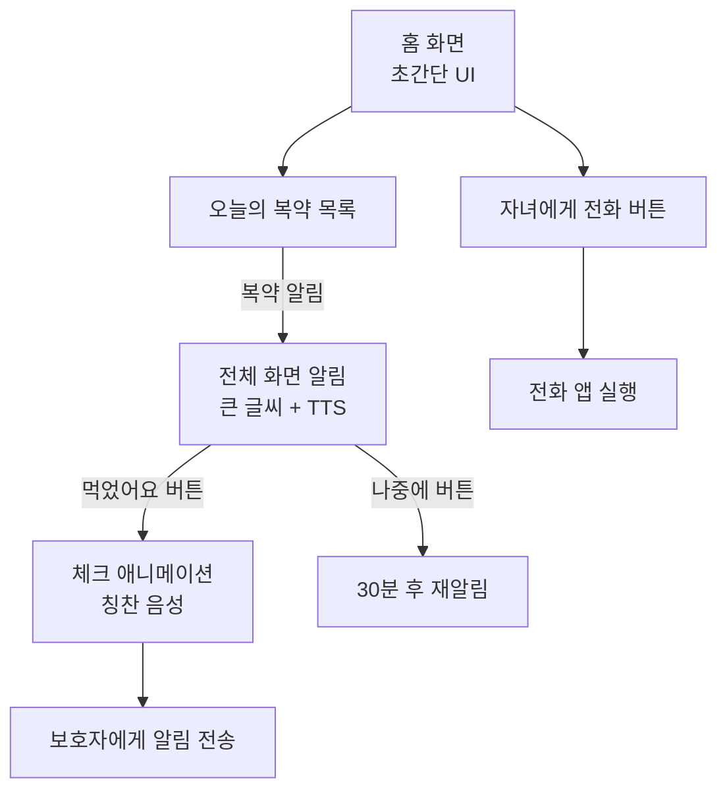
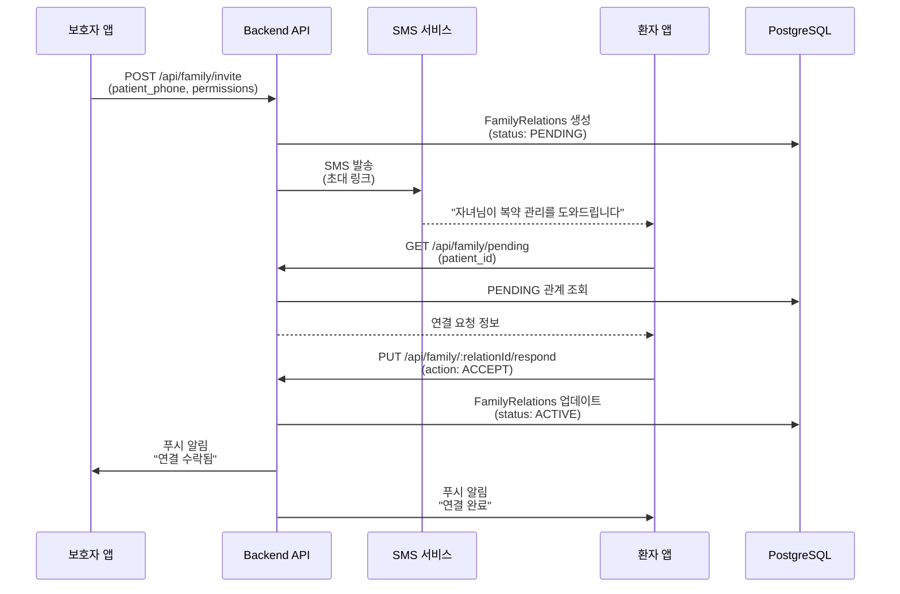
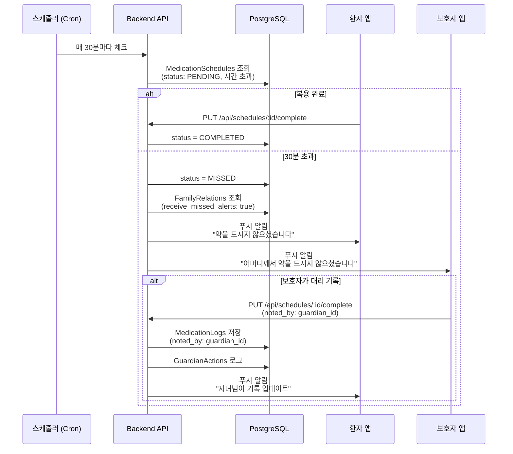

# 🟡 가족 공동 관리 기능 상세 명세

> 상위 문서: [[P1 - Post-MVP 기능]] | [[🏠 요약 - 프로젝트 홈]]

---

## 📋 기능 개요

| 항목 | 내용 |
|------|------|
| **기능명** | 가족 공동 복약 관리 |
| **목표** | 보호자가 고령 환자의 복약을 원격으로 관리하고, 복약 미이행 시 알림 수신 |
| **타겟 사용자** | 보호자 (자녀), 고령 환자 (부모님) |
| **우선순위** | P1 (Post-MVP, 핵심 차별화 기능) |
| **핵심 가치** | 디지털 취약층(고령자) 복약 관리의 현실적 해결책 |

---

## 🎯 문제 정의 및 솔루션

### 기존 복약 앱의 문제점
```
❌ 기존 앱들의 한계:
1. 본인 중심 설계: 환자가 직접 앱을 조작해야 함
2. 디지털 취약층 소외: 고령자는 앱 사용이 어려움
3. 알림 무시: 고령자는 푸시 알림을 보지 못하거나 무시함
4. 복약 확인 불가: 보호자가 부모님의 복약 여부를 알 수 없음
```

### 현실
```
✅ 실제 상황:
- 부모님 약은 자녀가 챙겨주는 경우가 많음
- 보호자가 대신 복약 스케줄을 설정하고 싶어 함
- 어르신은 앱 조작이 어려워도 복약 관리가 가장 필요한 집단
- 보호자는 부모님이 약을 먹었는지 확인하고 싶어 함
```

### 솔루션
```
💡 요약 앱의 차별화:
1. 원격 복약 스케줄 설정: 보호자가 부모님 폰에 알림 등록
2. 복약 미이행 알림: 부모님이 약을 안 먹으면 보호자에게 알림
3. 대리 기록: 보호자가 부모님 복약을 대신 기록
4. 긴급 경고 공유: 병용금기 등 위험 상황을 보호자도 알림 받음
5. 간편 UI: 어르신은 단순 알림만, 복잡한 조작은 보호자가
```

---

## 🎯 사용자 시나리오

### 시나리오 1: 가족 연결 (초기 설정)
```
홍길동(45세, 자녀)이 어머니(75세)의 복약 관리를 돕고 싶습니다.

[자녀 앱]
1. 요약 앱을 다운로드하고 회원가입합니다 (role: GUARDIAN).
2. 홈 화면에서 "가족 관리" 탭으로 이동합니다.
3. "가족 추가하기" 버튼을 탭합니다.
4. 연결 방법 선택:
   - 📱 "부모님 폰 번호로 초대" (추천)
   - 📧 "이메일로 초대"
   - 🔗 "초대 링크 공유"

5. 어머니의 폰 번호(010-1234-5678)를 입력합니다.
6. 관계 선택: "부모님"
7. 권한 설정:
   ☑ 복약 스케줄 원격 관리 (기본 ON)
   ☑ 복약 미이행 시 알림 받기 (기본 ON)
   ☑ 긴급 경고 공유 (기본 ON)

8. "초대 전송" 버튼을 탭합니다.

[어머니 앱]
9. 어머니의 폰에 SMS 알림이 옵니다:
   "자녀(홍길동)님이 복약 관리를 도와드리려고 합니다.
   요약 앱을 다운로드하고 수락해주세요.
   [다운로드 링크]"

10. 어머니가 앱을 다운로드하고 회원가입합니다 (role: PATIENT).
11. 자동으로 연결 요청 화면이 나타납니다:
    "자녀(홍길동)님이 복약 관리를 도와드리려고 합니다.
    수락하시겠어요?

    홍길동님이 할 수 있는 일:
    - 복약 시간 알림 설정
    - 약을 안 드셨을 때 알림 받기
    - 위험한 약 조합 알림 받기

    [수락] [거절]"

12. 어머니가 "수락" 버튼을 탭합니다.

[자녀 앱]
13. 홍길동의 앱에 알림:
    "어머니(홍부모)님이 연결을 수락했습니다!"
14. "가족 관리" 화면에 어머니 프로필이 나타납니다.
```

---

### 시나리오 2: 보호자가 원격으로 복약 스케줄 설정
```
홍길동이 어머니의 새로운 처방전을 대신 등록하고 스케줄을 설정합니다.

[자녀 앱]
1. "가족 관리" → "어머니 (홍부모)" 프로필 선택.
2. "처방전 스캔" 버튼을 탭합니다.
3. 어머니의 처방전을 촬영합니다.
4. OCR 결과 확인 후 "어머니 처방전에 추가" 선택.
5. 골든타임 스케줄러가 최적 복약 시간을 제안:
   - 아침 8:00 (혈압약)
   - 아침 8:30 (식후 30분, 타이레놀)
   - 저녁 7:30 (식후 30분, 타이레놀)

6. "스케줄 확인 및 등록" 버튼을 탭합니다.
7. 확인 메시지:
   "어머니의 폰에 복약 알림이 등록됩니다.
   [확인]"

8. "확인"을 탭합니다.

[어머니 앱]
9. 어머니의 폰에 푸시 알림:
   "자녀(홍길동)님이 새로운 처방전을 추가했습니다.
   혈압약 외 2가지 약
   [확인하기]"

10. 알림을 탭하면 처방전 상세 화면으로 이동.
11. 큰 글씨로 복약 스케줄이 표시됩니다:
    "매일 오전 8시: 혈압약 1알
     매일 오전 8시 30분: 타이레놀 1알
     매일 저녁 7시 30분: 타이레놀 1알"

12. TTS로 자동 읽어줍니다 (시니어 모드).

[시스템]
13. 어머니의 폰에 매일 복약 알림이 자동 전송됩니다.
```

---

### 시나리오 3: 복약 미이행 시 보호자 알림
```
어머니가 아침 8시 혈압약을 복용하지 않았습니다.

[시스템]
1. 예정 시간: 2026-02-24 08:00
2. 알림 전송: 어머니 폰에 "혈압약 드실 시간입니다" 푸시
3. 30분 경과 (08:30)까지 "복용 완료" 체크 없음
4. 시스템이 자동으로 MISSED 상태로 변경
5. GuardianAlert 트리거

[자녀 앱]
6. 홍길동의 폰에 푸시 알림:
   "⚠️ 어머니께서 오전 8시 혈압약을 드시지 않으셨습니다.
   [전화하기] [나중에 드심으로 기록]"

7. 홍길동이 "전화하기" 버튼을 탭합니다.
8. 어머니께 전화 연결됩니다.
9. 어머니: "아, 깜빡했네! 지금 먹을게."
10. 홍길동이 "나중에 드심으로 기록" 버튼을 탭합니다.

[시스템]
11. MedicationLogs 생성:
    - action: DELAYED
    - noted_by: son_id (보호자)
    - note: "전화 확인 후 복용 예정"

12. 어머니 앱에 알림:
    "자녀(홍길동)님이 복약 기록을 업데이트했습니다."
```

---

### 시나리오 4: 긴급 경고 공유 (병용금기)
```
어머니가 새로운 약을 추가하려는데, 기존 약과 상호작용이 감지되었습니다.

[어머니 앱]
1. 어머니가 약국에서 새로운 약(아스피린)을 받았습니다.
2. 약 봉투를 촬영하여 OCR 스캔합니다.
3. 시스템이 InteractionMatrix를 조회합니다.
4. 상호작용 감지:
   - 기존 약: 타이레놀 (해열진통제)
   - 새 약: 아스피린 (항혈소판제)
   - 위험도: HIGH (위장 출혈 위험 증가)

5. 어머니 앱에 큰 글씨 경고 화면:
   "🚨 주의하세요!
   타이레놀과 아스피린을 함께 먹으면
   위장 출혈 위험이 있습니다.

   의사나 약사와 상담하세요.

   [확인했어요] [자녀에게 알리기]"

[자녀 앱]
6. 동시에 홍길동의 폰에도 즉시 푸시 알림:
   "🚨 긴급: 어머니께서 위험한 약 조합이 감지되었습니다!
   타이레놀 + 아스피린: 위장 출혈 위험
   [자세히 보기] [전화하기]"

7. 홍길동이 "전화하기"를 탭하여 어머니께 즉시 연락합니다.
8. 어머니: "약국에서 방금 받았어. 어떡하지?"
9. 홍길동: "의사 선생님께 다시 문의드려볼게요."

[시스템]
10. InteractionWarnings 테이블에 저장:
    - severity: HIGH
    - is_acknowledged: false
    - 보호자·환자 모두 알림 전송 완료

11. 어머니가 "확인했어요"를 탭하면:
    - is_acknowledged: true
    - acknowledged_by: mother_id
    - acknowledged_at: 현재 시간
```

---

### 시나리오 5: 어르신용 간편 UI (단순 알림만)
```
어머니는 앱 조작이 어렵지만, 알림은 받을 수 있습니다.

[어머니 앱 - 시니어 모드]
1. 홈 화면: 초간단 UI
   ┌─────────────────────────────────┐
   │  오늘 드실 약                   │
   │                                 │
   │  ✅ 아침 8:00  혈압약           │
   │     (드셨어요)                  │
   │                                 │
   │  ⏰ 아침 8:30  타이레놀         │
   │     곧 알림이 올 거예요         │
   │                                 │
   │  📞 자녀에게 전화하기           │
   │     (큰 버튼)                   │
   └─────────────────────────────────┘

2. 아침 8:30 알림이 옵니다:
   - 푸시 알림: "타이레놀 드실 시간입니다"
   - 알림 탭 시 → 전체 화면 표시:
     ┌─────────────────────────────────┐
     │  💊 타이레놀                    │
     │                                 │
     │  [큰 약품 이미지]               │
     │                                 │
     │  1알 드세요                     │
     │  식사 후 30분                   │
     │                                 │
     │  [🔊 듣기] (TTS 자동 재생)      │
     │                                 │
     │  [✅ 먹었어요] (큰 버튼)        │
     │  [나중에]                       │
     └─────────────────────────────────┘

3. 어머니가 "먹었어요" 버튼을 탭합니다.
4. 큰 체크 애니메이션:
   "✅ 잘하셨어요!
   다음은 저녁 7시 30분이에요."

5. 진동 피드백 + 칭찬 음성:
   "잘하셨습니다!"

[자녀 앱]
6. 홍길동의 앱에도 실시간 업데이트:
   "어머니께서 오전 8:30 타이레놀을 드셨습니다 ✅"
```

---

## 🖼️ 화면 플로우

### 보호자 화면 플로우
```mermaid
graph TD
    A[홈 화면] -->|"가족 관리" 탭| B[가족 목록]

    B -->|"가족 추가"| C[연결 방법 선택]
    C -->|폰 번호 입력| D[권한 설정]
    D --> E[초대 전송]

    B -->|가족 선택| F[환자 대시보드<br/>보호자 뷰]

    F --> G[복약 순응도 요약]
    F --> H[미복용 알림 목록]
    F --> I[처방전 관리]
    F --> J[긴급 경고]

    G -->|낮은 순응도| K["전화하기" 버튼]

    H -->|미복용 약 선택| L["복용 완료" 또는<br/>"나중에 드심"]
    L --> M[대리 기록<br/>GuardianActions]

    I -->|"처방전 스캔"| N[카메라]
    N --> O[OCR 처리]
    O --> P[스케줄 생성<br/>환자 폰에 알림 등록]

    J -->|병용금기 감지| Q["전화하기"<br/>"자세히 보기"]
```

---

### 환자 화면 플로우 (시니어 모드)


---

## 📱 화면 상세 명세

### 1. 가족 추가 화면 (보호자)

#### UI 요소
```
┌─────────────────────────────────┐
│  가족 추가하기                  │
│                                 │
│  어떻게 연결하시겠어요?         │
│                                 │
│  📱 폰 번호로 초대 (추천)       │
│     빠르고 간편합니다           │
│     [선택]                      │
│                                 │
│  📧 이메일로 초대               │
│     이메일 주소를 아는 경우     │
│     [선택]                      │
│                                 │
│  🔗 초대 링크 공유              │
│     카카오톡 등으로 공유        │
│     [선택]                      │
│                                 │
│  [취소]                         │
└─────────────────────────────────┘
```

---

### 2. 권한 설정 화면 (보호자)

```
┌─────────────────────────────────┐
│  가족 연결 설정                 │
│                                 │
│  관계:                          │
│  ◉ 부모님                       │
│  ○ 배우자                       │
│  ○ 자녀                         │
│  ○ 형제자매                     │
│  ○ 기타                         │
│                                 │
│  권한 설정:                     │
│  ☑ 복약 스케줄 원격 관리        │
│     제가 부모님의 복약 시간을   │
│     설정할 수 있습니다          │
│                                 │
│  ☑ 복약 미이행 시 알림 받기     │
│     부모님이 약을 안 드시면     │
│     저에게 알림이 옵니다        │
│                                 │
│  ☑ 긴급 경고 공유               │
│     위험한 약 조합 등을         │
│     함께 알림 받습니다          │
│                                 │
│  [초대 전송]                    │
└─────────────────────────────────┘
```

---

### 3. 환자 대시보드 (보호자 뷰)

```
┌─────────────────────────────────┐
│  👵 어머니 (홍부모)              │
│  75세 | 당뇨, 고혈압            │
│  [전화하기] [메시지]            │
├─────────────────────────────────┤
│  📊 이번 주 복약 순응도         │
│  ████░░░░░░ 40% ⚠️ 주의         │
│  지난주: 60% → 이번주: 40%      │
│  (-20% 하락)                    │
│  [상세 보기]                    │
├─────────────────────────────────┤
│  🚨 미복용 알림 (3건)           │
│  ❌ 오늘 08:00  혈압약          │
│     [대신 기록하기]             │
│  ❌ 어제 19:30  타이레놀        │
│     [대신 기록하기]             │
│  ...                            │
├─────────────────────────────────┤
│  ⚠️ 긴급 경고 (1건)            │
│  🔴 타이레놀 + 아스피린         │
│     위장 출혈 위험              │
│     [자세히 보기]               │
├─────────────────────────────────┤
│  📋 처방전                      │
│  🏥 2026-02-20  서울대병원      │
│     타이레놀, 혈압약 외 1개     │
│  [+ 새 처방전 스캔]             │
└─────────────────────────────────┘
```

---

### 4. 대리 기록 모달 (보호자)

```
┌─────────────────────────────────┐
│  어머니의 복약 기록             │
│                                 │
│  💊 타이레놀정 500mg            │
│  예정: 오늘 13:30               │
│                                 │
│  어머니께서 드셨나요?           │
│                                 │
│  [✅ 드셨어요]                  │
│  (지금 시간으로 기록)           │
│                                 │
│  [⏰ 나중에 드심]               │
│  (지연 기록)                    │
│                                 │
│  [❌ 안 드심]                   │
│  (미복용 기록)                  │
│                                 │
│  메모 (선택):                   │
│  [전화로 확인함]                │
│                                 │
│  [취소]           [확인]        │
└─────────────────────────────────┘
```

**확인 버튼 클릭 시:**
- MedicationLogs 생성:
  - `user_id`: mother_id
  - `noted_by`: son_id
  - `action`: TAKEN / DELAYED / SKIPPED
  - `note`: "전화로 확인함"
- GuardianActions 로그 저장
- 어머니 앱에 알림: "자녀(홍길동)님이 복약 기록을 업데이트했습니다"

---

### 5. 어르신용 간편 홈 (시니어 모드)

```
┌─────────────────────────────────┐
│                                 │
│  오늘 드실 약 (2026-02-23)      │
│                                 │
│  ✅ 아침 8:00                   │
│     혈압약 1알                  │
│     드셨어요!                   │
│                                 │
│  ⏰ 아침 8:30                   │
│     타이레놀 1알                │
│     곧 알림이 올 거예요         │
│                                 │
│  ⏰ 저녁 7:30                   │
│     타이레놀 1알                │
│                                 │
│                                 │
│  ┌─────────────────────────┐   │
│  │  📞 자녀에게 전화하기    │   │
│  │  (홍길동)                │   │
│  └─────────────────────────┘   │
│                                 │
│  ┌─────────────────────────┐   │
│  │  🚨 긴급 상황 버튼       │   │
│  │  (119 자동 연결)         │   │
│  └─────────────────────────┘   │
│                                 │
└─────────────────────────────────┘

- 폰트 크기: 36px (매우 큼)
- 버튼 크기: 80x80px (터치 영역 확보)
- 색상: 고대비 (배경 흰색, 텍스트 검정)
```

---

### 6. 전체 화면 복약 알림 (어르신)

```
┌─────────────────────────────────┐
│                                 │
│                                 │
│  💊                             │
│  [큰 약품 이미지]               │
│                                 │
│  타이레놀                       │
│  1알 드세요                     │
│                                 │
│  식사 후 30분                   │
│                                 │
│  ┌─────────────────────────┐   │
│  │  🔊 듣기                 │   │
│  │  (TTS 자동 재생)         │   │
│  └─────────────────────────┘   │
│                                 │
│  ┌─────────────────────────┐   │
│  │  ✅ 먹었어요             │   │
│  │  (초대형 버튼)           │   │
│  └─────────────────────────┘   │
│                                 │
│  [나중에]                       │
│                                 │
└─────────────────────────────────┘

- TTS 자동 재생: "타이레놀 1알을 드세요. 식사 후 30분입니다."
- "먹었어요" 버튼: 화면의 50% 차지
- 진동 피드백: 버튼 탭 시
```

**"먹었어요" 버튼 클릭 시:**
```
┌─────────────────────────────────┐
│                                 │
│                                 │
│                                 │
│         ✅                      │
│      (애니메이션)               │
│                                 │
│   잘하셨어요!                   │
│                                 │
│   다음은 저녁 7시 30분이에요    │
│                                 │
│                                 │
│  🔊 "잘하셨습니다!"             │
│  (칭찬 음성 재생)               │
│                                 │
│                                 │
│  (3초 후 자동 닫힘)             │
│                                 │
└─────────────────────────────────┘
```

---

## 🔄 프로세스 플로우

### 가족 연결 프로세스


---

### 복약 미이행 알림 프로세스


---

## 🧪 테스트 케이스

### 기능 테스트

#### TC-1: 가족 연결 (폰 번호)
**입력:**
- 보호자: 홍길동 (guardian_id)
- 환자 폰: 010-1234-5678
- 관계: PARENT
- 권한: `can_manage_medication: true`, `receive_missed_alerts: true`

**예상 출력:**
- FamilyRelations 생성 (status: PENDING)
- SMS 발송: "자녀(홍길동)님이 복약 관리를 도와드리려고 합니다..."
- 환자가 수락 → status: ACTIVE

**수용 기준:**
- [ ] SMS 발송 성공
- [ ] 환자 앱에서 연결 요청 확인 가능
- [ ] 수락 시 status: ACTIVE로 변경
- [ ] 거절 시 status: REJECTED로 변경

---

#### TC-2: 보호자가 원격으로 스케줄 생성
**입력:**
- 보호자: 홍길동
- 환자: 어머니 (mother_id)
- 처방전: 타이레놀 1일 3회
- 생성자: guardian_id

**예상 출력:**
- MedicationSchedules 생성:
  - `user_id`: mother_id
  - `created_by`: guardian_id
- 어머니 앱에 푸시 알림
- 어머니 폰에 매일 복약 알림 등록

**수용 기준:**
- [ ] `created_by` != `user_id` (보호자가 환자 대신 생성)
- [ ] 어머니에게 알림 전송
- [ ] GuardianActions 로그 저장

---

#### TC-3: 복약 미이행 시 보호자 알림
**입력:**
- 환자: 어머니
- 예정 시간: 08:00
- 실제 시간: 08:35 (35분 경과)
- 보호자: `receive_missed_alerts: true`

**예상 출력:**
- 08:30에 status: MISSED로 변경 (30분 경과)
- 보호자 앱에 푸시 알림:
  "어머니께서 오전 8시 혈압약을 드시지 않으셨습니다"

**수용 기준:**
- [ ] 30분 경과 후 MISSED로 변경
- [ ] 보호자에게만 알림 (환자는 이미 알고 있음)
- [ ] 알림에 "전화하기", "대신 기록" 버튼 포함

---

#### TC-4: 보호자가 대신 복용 기록
**입력:**
- 보호자: 홍길동
- 환자: 어머니
- 보호자가 전화로 확인 후 "드셨어요" 클릭

**예상 출력:**
- MedicationLogs:
  - `user_id`: mother_id
  - `noted_by`: guardian_id
  - `action`: TAKEN
  - `note`: "전화로 확인함"
- GuardianActions 로그:
  - `action_type`: MARK_TAKEN
- 어머니 앱에 알림

**수용 기준:**
- [ ] MedicationLogs 생성 (noted_by = guardian_id)
- [ ] GuardianActions 감사 로그
- [ ] 어머니에게 알림
- [ ] 순응도 즉시 업데이트

---

#### TC-5: 긴급 경고 공유
**입력:**
- 환자: 어머니 (타이레놀 복용 중)
- 새 약: 아스피린
- InteractionMatrix: severity = HIGH

**예상 출력:**
- InteractionWarnings 생성
- 환자 앱에 경고:
  "🚨 주의하세요! 타이레놀과 아스피린..."
- 보호자 앱에도 즉시 알림:
  "🚨 긴급: 어머니께서 위험한 약 조합..."

**수용 기준:**
- [ ] InteractionMatrix 조회
- [ ] 환자·보호자 모두에게 알림
- [ ] 보호자 알림에 "전화하기" 버튼
- [ ] InteractionWarnings 테이블 저장

---

## ⚠️ 에러 처리

| 에러 코드 | HTTP | 원인 | 사용자 메시지 | 액션 |
|-----------|------|------|---------------|------|
| `ALREADY_CONNECTED` | 400 | 이미 연결됨 | "이미 연결된 가족입니다." | 기존 연결 확인 |
| `INVITE_EXPIRED` | 410 | 초대 만료 (7일) | "초대가 만료되었습니다. 다시 초대하세요." | 재초대 |
| `PERMISSION_DENIED` | 403 | 권한 없음 | "이 작업을 수행할 권한이 없습니다." | 권한 요청 |
| `PATIENT_NOT_FOUND` | 404 | 환자 미가입 | "연결하려는 분이 아직 앱에 가입하지 않았습니다." | 가입 유도 |

---

## 📊 데이터 모델

### FamilyRelations 테이블 (참조)
```sql
CREATE TABLE FamilyRelations (
    relation_id UUID PRIMARY KEY,
    guardian_id UUID NOT NULL REFERENCES Users(user_id),
    patient_id UUID NOT NULL REFERENCES Users(user_id),
    relationship_type ENUM('PARENT', 'CHILD', 'SPOUSE', 'SIBLING', 'OTHER'),

    can_manage_medication BOOLEAN DEFAULT TRUE,
    receive_missed_alerts BOOLEAN DEFAULT TRUE,
    receive_emergency_alerts BOOLEAN DEFAULT TRUE,

    status ENUM('ACTIVE', 'PENDING', 'REJECTED'),
    created_at TIMESTAMP DEFAULT CURRENT_TIMESTAMP
);
```

### GuardianActions 테이블 (참조)
```sql
CREATE TABLE GuardianActions (
    action_id UUID PRIMARY KEY,
    relation_id UUID NOT NULL REFERENCES FamilyRelations(relation_id),
    guardian_id UUID NOT NULL,
    patient_id UUID NOT NULL,
    action_type ENUM('CREATE_SCHEDULE', 'UPDATE_SCHEDULE', 'DELETE_SCHEDULE', 'MARK_TAKEN', 'VIEW_HISTORY'),
    target_id UUID,
    details JSONB,
    created_at TIMESTAMP DEFAULT CURRENT_TIMESTAMP
);
```

---

## 🔗 관련 API

- `POST /api/family/invite` - 가족 초대
- `PUT /api/family/:relationId/respond` - 초대 수락/거절
- `GET /api/family/patients` - 보호자가 관리하는 환자 목록
- `GET /api/family/:relationId/actions` - 보호자 활동 로그

자세한 API 명세는 [[API 명세서]] 참조

---

## 📚 관련 문서

- [[P1 - Post-MVP 기능]]
- [[ERD - 데이터베이스 설계]]
- [[API 명세서]]
- [[P0-5 복약 기록 대시보드]]

---

## ✅ 수용 기준 (Definition of Done)

- [ ] 가족 연결 요청 (폰 번호, 이메일, 링크)
- [ ] 초대 SMS/이메일 발송
- [ ] 환자가 수락/거절 가능
- [ ] 보호자가 환자의 복약 스케줄 원격 생성
- [ ] 보호자가 환자 대신 복용 기록 가능
- [ ] 복약 미이행 시 보호자에게 알림 (30분 경과)
- [ ] 긴급 경고 (병용금기) 보호자에게도 알림
- [ ] 보호자 대시보드 (환자 순응도, 미복용 목록)
- [ ] 어르신용 간편 홈 (시니어 모드)
- [ ] 전체 화면 복약 알림 (큰 글씨 + TTS)
- [ ] "먹었어요" 버튼 (초대형, 칭찬 음성)
- [ ] "자녀에게 전화하기" 원터치 버튼
- [ ] GuardianActions 감사 로그
- [ ] 권한 설정 (복약 관리, 미이행 알림, 긴급 경고)
- [ ] 연결 해제 기능

---

*최종 수정: 2026-02-23 | 버전: v1.0 | 작성자: 기획자*
