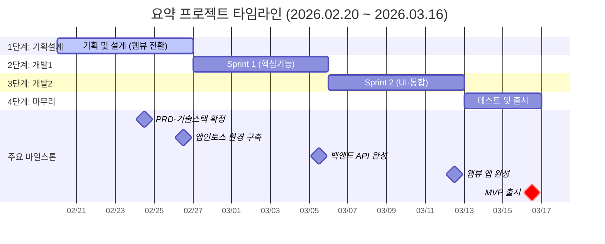

# 📅 전체 타임라인 (3.5주)

> 상위 문서: [[🏠 요약 - 프로젝트 홈]]

---

## 단계별 개요

| 단계 | 기간 | 일정 | 상태 |
|------|------|------|------|
| 1단계: 기획 및 설계 | 1주 | 2/20 – 2/26 | 🟡 진행중 |
| 2단계: 개발 Sprint 1 | 1주 | 2/27 – 3/5 | ⬜ 예정 |
| 3단계: 개발 Sprint 2 | 1주 | 3/6 – 3/12 | ⬜ 예정 |
| 4단계: 테스트 및 출시 | 0.5주 | 3/13 – 3/16 | ⬜ 예정 |

---

## 간트 차트



---

## 스프린트 상세

```dataview
TABLE WITHOUT ID
  스프린트 as "스프린트",
  시작일 as "시작",
  종료일 as "종료",
  주요업무 as "주요 업무",
  상태 as "상태"
FROM "20-프로젝트/21-진행중/요약/06-스프린트"
WHERE file.name != "T_스프린트"
SORT 시작일 ASC
```

| 스프린트 | 일정 | 주요 업무 |
|----------|------|-----------|
| **Sprint 1** | 2/27-3/5 | 백엔드 API 개발 (Vision AI, OCR, LLM, 챗봇) |
| **Sprint 2** | 3/6-3/12 | 웹뷰 프론트엔드 개발 (TDS UI, TTS, 대시보드) |

---

## 주요 마일스톤

| 마일스톤 | 날짜 | 상태 |
|----------|------|------|
| PRD·기술스택 확정 (웹뷰 전환) | 2026-02-24 | 🟡 진행중 |
| 앱인토스 환경 구축 (TDS 설정) | 2026-02-26 | ⬜ |
| Sprint 1 완료 (백엔드 API) | 2026-03-05 | ⬜ |
| Sprint 2 완료 (웹뷰 앱) | 2026-03-12 | ⬜ |
| 테스트 완료 | 2026-03-15 | ⬜ |
| **MVP 출시** | **2026-03-16** | ⬜ |

---

## 관련 문서
- [[01-PRD]]
- [[02-기능명세]]
- [[03-기술아키텍처]]
- [[06-스프린트]]
