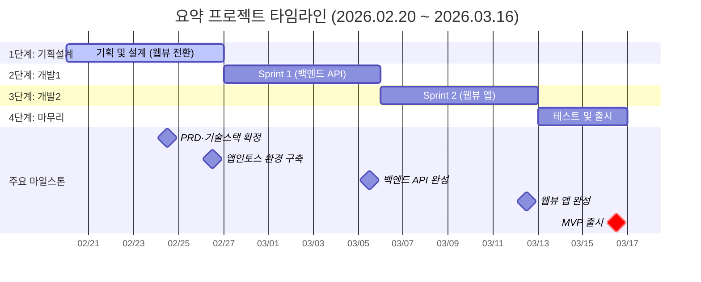
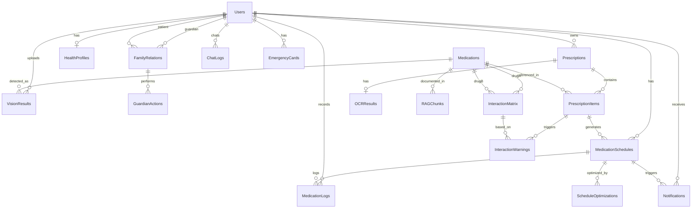

# 📋 요약(要藥) 프로젝트 완전 통합 문서

**작성일**: 2026-02-23
**버전**: v1.0
**상태**: 진행중
**프로젝트 기간**: 2026-02-20 ~ 2026-03-16 (3.5주)

---

## 목차

1. [프로젝트 개요](#프로젝트-개요)
2. [타임라인](#타임라인)
3. [PRD - 제품 요구사항 문서](#prd---제품-요구사항-문서)
4. [P0 - MVP 핵심기능](#p0---mvp-핵심기능)
5. [P1 - Post-MVP 기능](#p1---post-mvp-기능)
6. [P2 - Future Scope](#p2---future-scope)
7. [시스템 아키텍처](#시스템-아키텍처)
8. [알약 식별 파이프라인 역할 분리](#알약-식별-파이프라인-역할-분리)
9. [OpenAI API + RAG 구현 5단계](#openai-api--rag-구현-5단계)
10. [기술 스택](#기술-스택)
11. [ERD - 데이터베이스 설계](#erd---데이터베이스-설계)
12. [API 명세서](#api-명세서)
13. [데이터 전략 및 보안](#데이터-전략-및-보안)
14. [UI/UX 디자인 가이드](#uiux-디자인-가이드)
15. [스프린트 계획](#스프린트-계획)

---

## 프로젝트 개요

### 제품 비전

> 비전 AI · OCR · LLM 기술을 융합하여 환자가 **스스로 약을 이해하고 올바르게 복용**할 수 있도록 돕는 맞춤형 복약 가이드 서비스.

### 한눈에 보기

| 항목 | 내용 |
|------|------|
| **제품명** | 요약 (要藥) |
| **플랫폼** | 토스 앱인토스 (Apps-in-Toss WebView) |
| **프론트엔드** | Vite + React + TypeScript + TDS (토스 디자인 시스템) |
| **핵심 기술** | Vision AI (YOLO) · OCR (Naver Clova) · LLM (OpenAI GPT-4o) · RAG |
| **프로젝트 기간** | 3.5주 (2026-02-20 ~ 2026-03-16) |
| **MVP 출시일** | 2026-03-16 |
| **현재 단계** | 1단계: 기획 및 설계 (웹뷰 전환 완료) |
| **주요 외부 API** | OpenAI API (GPT-4o-mini/4o) · Naver Clova OCR · 앱인토스 알림 API |

### 타겟 고객

| 유형 | 설명 |
|------|------|
| **주요 타겟 1** | 60대 이상 고령층 — 복잡한 처방 이해 어려움 |
| **주요 타겟 2** | 만성 질환자 — 당뇨·고혈압 등 다약제 복용 |
| **주요 타겟 3** | 보호자 — 부모님·자녀 복약 관리 대리 |
| **주요 타겟 4** | 약국/약사 — 복약 지도 효율화 |
| **확장 타겟** | 일시적 복약자 — 부작용·주의사항 정보 필요 |

### KPI (핵심 성과 지표)

| 지표 | 목표값 | 비고 |
|------|--------|------|
| AI 인식 성공률 (OCR/Vision) | 98% 이상 | 비기능 요구사항 |
| 전체 프로세스 응답 시간 | 5초 이내 | 비기능 요구사항 |
| MVP 출시 | 2026-03-16 | 마일스톤 |

### 주요 리스크 & 이슈

- [ ] 의료정보 관련 법률 자문 완료 필요 (개인정보보호법, 의료법)
- [ ] OpenAI API 사용량 모니터링 및 최적화 (헬스케어 1기 지원 활용)
- [ ] 약학정보원 데이터 라이선스 확인 필요
- [ ] 앱스토어 헬스케어 앱 심사 기준 사전 검토 필요

---

## 타임라인

### 전체 타임라인 (3.5주)

**시작일**: 2026-02-20
**MVP 목표**: 2026-03-16
**총기간**: 3.5주 (24일)

### 단계별 개요

| 단계 | 기간 | 일정 | 상태 |
|------|------|------|------|
| 1단계: 기획 및 설계 | 1주 | 2/20 – 2/26 | 🟡 진행중 |
| 2단계: 개발 Sprint 1 | 1주 | 2/27 – 3/5 | ⬜ 예정 |
| 3단계: 개발 Sprint 2 | 1주 | 3/6 – 3/12 | ⬜ 예정 |
| 4단계: 테스트 및 출시 | 0.5주 | 3/13 – 3/16 | ⬜ 예정 |

### 간트 차트



### 주요 마일스톤

| 마일스톤 | 날짜 | 상태 |
|----------|------|------|
| PRD·기술스택 확정 (웹뷰 전환) | 2026-02-24 | 🟡 진행중 |
| 앱인토스 환경 구축 (TDS 설정) | 2026-02-26 | ⬜ |
| Sprint 1 완료 (백엔드 API) | 2026-03-05 | ⬜ |
| Sprint 2 완료 (웹뷰 앱) | 2026-03-12 | ⬜ |
| 테스트 완료 | 2026-03-15 | ⬜ |
| **MVP 출시** | **2026-03-16** | ⬜ |

---

## PRD - 제품 요구사항 문서

### 제품 정의

비전 AI, OCR, LLM 기술을 융합하여 **알약 식별 + 처방전 분석 → 개인 맞춤형 복약 가이드**를 제공하고, 약국과 환자를 직접 연결하여 맞춤형 복약 알림을 전송하는 서비스.

### 핵심 사용자 시나리오

**시나리오 — 60대 당뇨 환자**

약국 조제 후 약사로부터 **'요약' 앱으로 복약지도 푸시 알림** 수신
→ **실버 모드**(큰 글씨) + 자동 음성 안내 "혈당 조절 약, 식후 30분"
→ '다시 듣기' 버튼으로 반복 청취
→ AI 챗봇에 "이 약 먹으면 졸려요?" 질문
→ "졸음이 올 수 있으니 운전 시 주의하세요" 맞춤 답변 수신

### 비기능적 요구사항

| 항목 | 기준 |
|------|------|
| **성능** | AI 분석(OCR·Vision) → 가이드 생성 전체 **5초 이내** |
| **정확성** | OCR/Vision AI 인식률 **98% 이상** |
| **보안** | 전송: SSL/TLS, 저장: AES-256, PHI 암호화 |
| **사용성** | 실버/시니어 모드, Voice-First, 고대비·대형 폰트 |
| **플랫폼** | 토스 앱인토스 웹뷰 앱, 약사 전용 웹 관리 도구 |
| **디자인 시스템** | TDS (토스 디자인 시스템) 필수 사용 |
| **면책 고지** | 모든 정보 화면 하단 "의사/약사 상담을 대체할 수 없습니다" 상시 노출 |
| **LLM 안전성** | System Prompt 엔지니어링 + RAG 기반 환각 억제 |

---

## P0 - MVP 핵심기능

### 1. 알약 식별 (Vision AI)

**목표**: 앱 카메라로 알약을 촬영하면 약품 정보를 자동 인식

| 항목 | 내용 |
|------|------|
| **입력** | 웹뷰 카메라 API (HTML5 getUserMedia) 촬영 알약 이미지 |
| **처리** | YOLOv8s 기반 객체 탐지 → FastAPI 메타데이터 재랭킹 |
| **출력** | 약품 이름, 성분, 분류 정보 |
| **정확도 목표** | 98% 이상 |
| **보조 전략** | 색상/모양/각인 메타데이터 활용 정제 |
| **데이터** | AIhub '경구약제 이미지 데이터' (약 5,000종 · 270만 장 이상) |
| **웹뷰 고려사항** | 카메라 접근 권한 처리, 파일 업로드 인터페이스 제공 |

**수용 기준**:
- [ ] 알약 촬영 후 5초 이내 결과 표시
- [ ] 인식 실패 시 "다시 촬영해주세요" 안내 노출
- [ ] 인식 결과에 약품명 + 성분 + 효능 표시

---

### 2. 복약지도문 OCR 스캔 및 자동 알림

**목표**: 처방전/약 봉투 촬영 → 텍스트 추출 → 복용 알림 자동 생성

| 항목 | 내용 |
|------|------|
| **입력** | 웹뷰 카메라 또는 파일 선택을 통한 처방전/약 봉투 이미지 |
| **OCR 엔진** | Naver Clova OCR (헬스케어 1기 지원) |
| **출력 1** | 약 이름, 복용 시간, 횟수, 주의사항 텍스트 |
| **출력 2** | 토스 앱인토스 알림 API를 통한 알림 등록 |
| **정확도 목표** | 98% 이상 |
| **웹뷰 고려사항** | 파일 입력 UI, 이미지 프리뷰, 진행 상태 표시 |

**수용 기준**:
- [ ] 처방전 촬영 → 복용 정보 자동 추출
- [ ] 추출된 복용 시간에 맞춰 알림 자동 등록
- [ ] 인식 결과 사용자 확인/수정 화면 제공

---

### 3. LLM 기반 맞춤형 가이드

**목표**: 의학 용어를 쉽게 번역·요약, 실버 모드 UI, TTS 자동 재생

#### 3-1. 의학 용어 번역 및 요약

| 항목 | 내용 |
|------|------|
| **입력** | OCR/Vision 추출 텍스트 + 사용자 건강 프로필 |
| **처리** | OpenAI API (GPT-4o-mini/4o) + RAG 아키텍처 |
| **출력** | 쉬운 언어의 복약 가이드 텍스트 |

#### 3-2. 실버/시니어 모드 UI

| 요소 | 기준 |
|------|------|
| 폰트 크기 | 일반 대비 150% 이상 |
| 표시 정보 | 약 이름 · 복용 시간 · 횟수만 간결하게 |
| 색상 대비 | WCAG AA 기준 이상 |
| 활성화 방법 | 설정 또는 자동(연령 기반) |
| **디자인 시스템** | TDS (토스 디자인 시스템) 컴포넌트 활용 |
| **반응형** | 웹뷰 환경에 최적화된 반응형 레이아웃 |

#### 3-3. TTS 자동 음성 안내

| 항목 | 내용 |
|------|------|
| **엔진** | Web Speech API (브라우저 네이티브) 또는 백엔드 TTS 서비스 |
| **트리거** | 복약 가이드 생성 완료 시 자동 재생 |
| **기능** | 다시 듣기 버튼, 음량 조절, 재생 속도 조절 |
| **웹뷰 고려사항** | 브라우저 자동재생 정책 대응, 사용자 인터랙션 후 재생 |
| **폴백** | Web Speech API 미지원 시 OS 네이티브 TTS 활용 |

**수용 기준**:
- [ ] 가이드 생성 완료 즉시 TTS 자동 재생
- [ ] 실버 모드 ON/OFF 전환 가능
- [ ] "다시 듣기" 버튼 항상 화면에 노출

---

### 4. AI 챗봇 상담 (RAG 기반)

**목표**: 전문 의약품 지식베이스 기반 정확·신뢰 높은 복약 Q&A

| 항목 | 내용 |
|------|------|
| **아키텍처** | RAG (Retrieval-Augmented Generation) |
| **지식베이스** | 약학정보원 (KIMS), 식약처 e약은요 API |
| **Vector DB** | Pinecone 또는 FAISS |
| **LLM** | OpenAI API (GPT-4o-mini/4o) |

**예시 질문 시나리오**:
- "이 약 먹고 커피 마셔도 되나요?"
- "부작용은 뭐가 있나요?"
- "식전에 먹어도 되나요?"

**수용 기준**:
- [ ] 지식베이스에 없는 질문은 "전문가 상담 권장" 안내
- [ ] 모든 답변 하단 면책 조항 노출
- [ ] 응답 시간 5초 이내

---

### 5. 복약 기록 관리 대시보드

**목표**: 스캔·전송받은 처방전·알약 이력 저장 및 관리

| 항목 | 내용 |
|------|------|
| **표시 방식** | 리스트 형태 (날짜 역순) |
| **항목** | 처방전 이미지, 약 이름, 복용 기간, 상태 |
| **저장소** | MySQL 8.0+ (정형 데이터) |

**수용 기준**:
- [ ] 스캔 이력 리스트 조회
- [ ] 항목 클릭 시 상세 복약 가이드 재열람
- [ ] 삭제 기능 제공

---

## P1 - Post-MVP 기능

### 1. 약국 연동 푸시 알림 서비스

**목표**: 약사가 조제 완료 후 환자에게 맞춤형 복약 지도를 직접 발송

| 항목 | 내용 |
|------|------|
| **플랫폼** | 웹 (React / Vue.js) |
| **주요 기능** | 환자 검색, 복약 지도문 작성, 푸시 발송 |
| **알림 서버** | 토스 앱인토스 알림 API |

**수용 기준**:
- [ ] 약사가 환자 이름·생년월일로 검색 가능
- [ ] 복약 지도 템플릿 제공 (약사 편의)
- [ ] 발송 이력 관리 기능

---

### 2. 휴일 운영 약국 찾기

| 항목 | 내용 |
|------|------|
| **API** | 네이버 플레이스 API |
| **기준** | 사용자 현재 위치 기반 |
| **표시 정보** | 약국명, 거리, 영업 시간, 전화번호 |

**수용 기준**:
- [ ] 위치 권한 허용 시 반경 내 운영 약국 표시
- [ ] 지도 뷰 및 리스트 뷰 전환 가능
- [ ] 전화 연결 버튼 제공

---

### 3. 개인 건강 프로필

| 입력 항목 | 예시 |
|-----------|------|
| 기저질환 | 당뇨, 고혈압, 신장 질환 등 |
| 알레르기 | 페니실린, 설파제 등 |
| 복용 중인 약 | 기존 처방약 리스트 |
| 연령 / 성별 | 실버 모드 자동 활성화 기준 |

**수용 기준**:
- [ ] 프로필 입력 시 맞춤형 가이드 정교화
- [ ] 데이터 암호화 저장 (PHI 기준)
- [ ] 언제든 수정·삭제 가능

---

### 4. 복약 순응도 트래킹

| 항목 | 내용 |
|------|------|
| **기능** | 알림 시 "복용 완료" 체크 버튼 |
| **리포트** | 주간 / 월간 복용률 차트 |
| **알림** | 미복용 시 재알림 (최대 N회) |

**수용 기준**:
- [ ] 알림에서 1탭으로 복용 완료 처리
- [ ] 주간 리포트 자동 생성 및 화면 노출
- [ ] 복용률 데이터 비식별화 후 서비스 개선 활용

---

## P2 - Future Scope

### 1. 건강 콘텐츠 (웹툰 연재)

**콘텐츠 발굴 전략**:
1. 유튜브 채널 (동공이 약사, 고약사 등) 스크립트 크롤링
2. 검색어 트렌드 분석 → 인기 키워드 도출
3. 수요 높은 주제 선정 → 웹툰 정기 제작

| 항목 | 내용 |
|------|------|
| **형식** | 웹툰 (카드뉴스 형태 또는 세로스크롤) |
| **주기** | 주 1회 이상 |
| **배포** | 앱 내 콘텐츠 탭 + SNS 연동 |

---

### 2. 가족 관리 기능

| 항목 | 내용 |
|------|------|
| **대상** | 보호자 (부모님·자녀·배우자 복약 관리) |
| **기능** | 여러 가족 프로필 추가, 통합 복약 현황 대시보드 |
| **알림** | 가족 구성원별 복약 알림 대리 수신 가능 |

---

### 3. 병용금기 약물 확인

| 항목 | 내용 |
|------|------|
| **기능** | 복용 중인 약물 리스트 기반 상호작용 경고 |
| **데이터** | 건강보험심사평가원 병용금기 데이터 |
| **표시** | 경고 배지 + 상세 설명 + 약사 상담 권장 |

---

## 시스템 아키텍처

### 아키텍처 원칙

> **마이크로서비스 아키텍처 (MSA) 기반 클라우드 네이티브**
> 안정성과 확장성을 모두 고려한 설계

### 전체 구조도

```
┌─────────────────────────────────────────────────┐
│                  클라이언트 (Client)               │
│  📱 토스 앱인토스 웹뷰   🖥️ 약사 전용 웹            │
│  (Vite+React+TS+TDS)    (React / Vue.js)        │
└──────────────────────┬──────────────────────────┘
                       │ HTTPS (SSL/TLS)
┌──────────────────────▼──────────────────────────┐
│           API Gateway (Nginx)                    │
│  SSL 종단 · 리버스 프록시 · Rate Limiting         │
└──────────────────────┬──────────────────────────┘
                       │
┌──────────────────────▼──────────────────────────┐
│         FastAPI 서버 (Python 3.13)              │
│  비즈니스 로직 · Tortoise ORM · JWT 인증          │
└──┬──────────┬────────────┬──────────────┬───────┘
   │          │            │              │
┌──▼──┐  ┌───▼────┐  ┌────▼─────┐  ┌────▼──────┐
│사용자│  │비전/OCR│  │LLM 가이드│  │ 알림      │
│서비스│  │서비스  │  │서비스    │  │ 서비스    │
└──┬──┘  └───┬────┘  └────┬─────┘  └────┬──────┘
   │          │            │              │
   │          │            │              │
   │      ┌───▼────────────▼─────┐        │
   │      │   AI Worker (별도)   │     FCM/APNS
   │      │  YOLO · LLM 추론     │
   │      │  PyTorch             │
   │      └────────┬─────────────┘
   │               │
   │        Naver Clova OCR
   │
┌──▼───────┐  ┌──────────┐  ┌──────────┐
│ MySQL    │  │ Redis    │  │ AWS S3   │
│ 8.0+     │  │ 7+       │  │          │
└──────────┘  └──────────┘  └──────────┘
```

### 레이어별 상세

**프론트엔드 (Client)**

| 클라이언트 | 기술 | 설명 |
|-----------|------|------|
| **토스 앱인토스 웹뷰** | Vite + React + TypeScript + TDS | 토스 앱 내 웹뷰 서비스 |
| **필수 패키지** | @apps-in-toss/web-framework | 앱인토스 SDK |
| **디자인 시스템** | TDS (토스 디자인 시스템) | 비게임 앱 필수 사용 |
| **약사 전용 웹** | React 또는 Vue.js | 푸시 알림 발송용 관리자 웹 |

**백엔드 마이크로서비스**

| 서비스 | 역할 |
|--------|------|
| **API Gateway (Nginx)** | 요청 수신 → 인증/인가 → 마이크로서비스 라우팅, SSL 종단 |
| **FastAPI 서버** | 비즈니스 로직, DB 쿼리 (Tortoise ORM), API 엔드포인트 |
| **AI Worker (별도 프로세스)** | 모델 추론/학습 작업 분리 (YOLO, LLM 호출) |
| **사용자/약국 서비스** | 환자·약국 회원 관리, 프로필 |
| **비전/OCR 서비스** | 이미지 수신 → YOLO (AI Worker) + Naver Clova OCR 호출 |
| **LLM 가이드 서비스** | RAG 파이프라인, 가이드 생성, 챗봇 답변 (AI Worker와 통신) |
| **알림 서비스** | 토스 앱인토스 알림 API를 통한 Push Notification 발송 |

### 외부 API 의존성

| API | 용도 | 비고 |
|-----|------|------|
| YOLO | 알약 객체 탐지 (1차) | YOLOv8 경량 모델 |
| OpenAI API | LLM (GPT-4o-mini / GPT-4o) | 헬스케어 1기 지원 — 개발: 4o-mini, 배포/데모: 4o |
| Naver Clova OCR | 처방전 텍스트 추출 | 한국어 특화, 헬스케어 1기 지원 (주제2 팀) |
| 식약처 e약은요 | 의약품 공공 데이터 | 무료 공공 API |
| AIhub 경구약제 이미지 | 알약 식별 학습 데이터 | 라이선스 확인 필요 |
| 네이버 플레이스 | 운영 약국 찾기 (P1) | P1 기능 |
| 토스 앱인토스 알림 API | 푸시 알림 | 웹뷰 환경 전용 |

---

## 알약 식별 파이프라인 역할 분리

### 전체 처리 플로우 (역할 분리 구조)

"비전 모델(YOLO)로 식별/탐지를 수행하고, OCR 엔진(Naver Clova)으로 처방문 텍스트를 추출한 뒤, OpenAI API(GPT-4o-mini/4o)로 개인 맞춤 복약지도를 생성하는 3단 분리 구조로 설계하여 정확도·확장성·개발 효율을 확보하였다."

---

### 플로우 A: 처방문 OCR → 복약지도

**역할 분리:**
1. **Naver Clova OCR**: 처방전 텍스트 추출 (이미지 → 텍스트)
2. **백엔드 로직 (FastAPI)**: 텍스트 파싱/정규화 (약품명, 용량, 횟수, 기간 등)
3. **OpenAI API (GPT-4o-mini/4o)**: 복약지도 생성 (복용법, 주의사항, 생활습관)

**처리 단계:**
```
사용자 처방전/진료기록 이미지 업로드
    ↓
Naver Clova OCR로 텍스트 추출
    ↓
추출 텍스트를 파싱/정규화 (약품명, 용량, 횟수, 기간 등)
    ↓
파싱 결과 + 사용자 입력(나이/질환/주의사항 등)을 OpenAI API에 전달
    ↓
복약지도(복용법/주의사항/생활습관) 생성 후 반환
```

---

### 플로우 B: 알약 이미지 식별 → 복약지도

**역할 분리:**
1. **YOLOv8s**: 알약 위치 탐지 + 후보 예측
2. **백엔드 로직 (FastAPI)**: 메타데이터/DB로 재랭킹 (색상/모양/각인 등)
3. **OpenAI API (GPT-4o-mini/4o)**: 복약지도 생성

**처리 단계:**
```
사용자 알약 이미지 업로드
    ↓
YOLOv8 추론 → 탐지 결과(Top-K 후보)
    ↓
후보를 메타데이터/DB로 재랭킹 (색상/모양/각인 등)
    ↓
최종 약품(또는 Top-3 후보)을 OpenAI API에 전달
    ↓
복약지도 생성 후 반환
```

---

### 전체 역할 구조

"식별 → 복약지도" 전체 파이프라인에서 각 역할을 누가 맡는지 구조적으로 정리

### 1단계: 알약 식별 (Vision AI)

**담당**: YOLOv8 기반 객체 탐지 모델

**역할**:
- 입력: 알약 이미지 (PNG)
- 출력:
  - Bounding Box
  - 클래스 후보 (Top-K)
  - Confidence score

**모델 제안**:
- YOLOv8n (초기 개발/속도 중심)
- YOLOv8s (정확도 향상 버전, 권장)
- Ultralytics YOLOv8 사용

**이유**:
- COCO 포맷 직접 지원
- FastAPI 연동 쉬움
- 실시간 추론 가능
- Docker 배포 용이

**👉 이 단계는 LLM이 아니라 YOLO가 담당**

### 2단계: 후보 정제 (Metadata Filtering)

**담당**: 백엔드 로직 (FastAPI 내부)

**처리**:
- YOLO 결과: Top-5 후보
- → JSON 메타데이터 기반 필터링

**활용 정보**:
- 색상
- 모양
- 각인 문자열
- 전문/일반 구분

**👉 이 단계는 규칙 기반 처리**
**👉 LLM 필요 없음**

### 3단계: 복약지도 생성 (Text Generation)

**담당**: OpenAI API (GPT-4o-mini / GPT-4o)

**입력**:
- 최종 식별된 약품명
- 성분
- 전문/일반 구분
- 사용자 진료 기록
- 복약 정보

**출력**:
- 복약 방법
- 주의사항
- 생활습관 가이드

**선택 이유**:
- 헬스케어 1기 지원
- 개발 기간: GPT-4o-mini
- 배포/데모 기간 (03.23~03.25): GPT-4o

**👉 복약지도 생성은 LLM의 역할**

### 역할 분리 요약

| 단계 | 담당 기술 | LLM 사용 여부 |
|------|----------|--------------|
| 알약 위치 탐지 | YOLOv8s | ❌ (컴퓨터 비전 모델) |
| 후보 정제 | FastAPI + MySQL | ❌ (규칙 기반 로직) |
| 복약지도 생성 | OpenAI API (GPT-4o-mini/4o) | ✅ (텍스트 생성) |

### 최종 아키텍처

```
[이미지 업로드]
        ↓
YOLOv8s (알약 탐지)
        ↓
Top-K 후보
        ↓
FastAPI 메타데이터 필터링 (색상/모양/각인)
        ↓
최종 약품 확정
        ↓
OpenAI API 호출 (GPT-4o-mini/4o)
        ↓
복약지도 생성
```

### 정의서용 결론

알약 식별은 **YOLOv8s 기반 객체 탐지 모델이 탐지를 담당**하며,
**FastAPI 백엔드 로직으로 메타데이터 기반 정제**를 수행한다.
식별된 약품 정보를 기반으로 **OpenAI API(GPT-4o-mini/4o)를 활용하여 맞춤형 복약지도를 생성**한다.
식별 단계와 생성 단계를 분리함으로써 **정확도와 확장성을 확보**하였다.

---

## OpenAI API + RAG 구현 5단계

### 전체 파이프라인

```
[1단계] Data Ingestion
공공 API + AIhub 데이터 파싱
→ 전처리 → 지식베이스(JSON/CSV) + Vector DB 구축

[2단계] Multi-modal Processing
사용자 촬영 이미지
→ YOLO (알약 식별) + Naver Clova OCR (텍스트 추출) 동시 처리
→ 이미지 내 텍스트 + 시각적 특징 교차 분석

[3단계] Contextual Prompting
사용자 건강 프로필
+ 2단계 약물 분석 결과
+ Vector DB RAG 검색 결과
→ 최적 컨텍스트 프롬프트 동적 구성

[4단계] Output Generation & Delivery
OpenAI API (GPT-4o-mini/4o) → 맞춤형 복약 가이드 생성
→ 실버 모드 UI 출력 + TTS 자동 변환 및 재생

[5단계] Feedback Loop
대화 로그 + 이용 패턴 비식별화 분석
→ RAG 지식베이스 주기적 업데이트
→ 프롬프트 엔지니어링 정교화
```

### 1단계: Data Ingestion

| 항목 | 내용 |
|------|------|
| **도구** | Python 스크립트 (주기적 파싱) |
| **데이터 소스 1** | 식약처 e약은요 API → 의약품 개요 정보 |
| **데이터 소스 2** | 약학정보원(KIMS) → 효능·용법·주의사항 |
| **데이터 소스 3** | AIhub 경구약제 이미지 (5,000종 · 270만 장) |
| **출력** | JSON/CSV 지식베이스 + Vector DB 임베딩 |
| **갱신 주기** | 월 1회 또는 식약처 업데이트 시 |

**구현 체크리스트**:
- [ ] e약은요 API 연동 스크립트 작성
- [ ] KIMS 데이터 파싱 파이프라인 구축
- [ ] AIhub 데이터 다운로드 및 전처리
- [ ] 임베딩 모델 선정 및 Vector DB 저장

---

### 2단계: Multi-modal Processing

| 항목 | 내용 |
|------|------|
| **API 호출** | YOLO + Naver Clova OCR |
| **동시 처리** | Vision (알약 탐지) + OCR (텍스트 추출) |
| **교차 검증** | 이미지 특징 + 추출 텍스트 대조 |
| **처리 방식** | YOLOv8s (알약 탐지) → FastAPI (메타데이터 재랭킹) |

**구현 체크리스트**:
- [ ] YOLOv8s 모델 학습 및 배포
- [ ] Naver Clova OCR API 연동 테스트 (헬스케어 1기 지원)
- [ ] 이미지 업로드 → API 호출 → 응답 파싱 구현
- [ ] 메타데이터 재랭킹 로직 구현 (색상/모양/각인)

---

### 3단계: Contextual Prompting

**프롬프트 구성 요소**:

```
System Prompt:
"당신은 전문 복약 가이드 AI입니다. 항상 안전하고 보수적인 답변을 제공하며,
의사/약사 상담을 대체할 수 없음을 명시합니다."

Context:
- 사용자 건강 프로필: {기저질환, 알레르기}
- 분석된 약물 정보: {약 이름, 성분, 용법}
- RAG 검색 결과: {약학정보원 관련 문서}

User Query:
{사용자 질문 또는 "복약 가이드 생성" 요청}
```

**구현 체크리스트**:
- [ ] System Prompt 초안 작성 및 검토
- [ ] 동적 프롬프트 템플릿 엔진 구현
- [ ] 건강 프로필 → 프롬프트 자동 삽입 로직
- [ ] RAG 검색 결과 → 컨텍스트 삽입 로직

---

### 4단계: Output Generation & Delivery

| 출력 채널 | 처리 방식 |
|-----------|-----------|
| **앱 화면** | 실버 모드 여부에 따라 UI 렌더링 분기 |
| **TTS** | OS 내장 TTS API (iOS: AVSpeechSynthesizer, Android: TextToSpeech) |
| **알림** | 복용 시간 기반 OS 알림 자동 등록 |
| **약사 웹** | 약사 발송 내용 → Push Notification 서버 |

**구현 체크리스트**:
- [ ] 실버 모드 UI 컴포넌트 개발
- [ ] TTS 자동 재생 + 다시 듣기 인터페이스 개발
- [ ] 복용 알림 자동 등록 로직 구현
- [ ] 면책 조항 모든 출력 화면 하단 노출 확인

---

### 5단계: Feedback Loop

| 항목 | 내용 |
|------|------|
| **수집 데이터** | 챗봇 대화 로그, 서비스 이용 패턴 |
| **처리** | 개인정보 비식별화 후 분석 |
| **활용** | FAQ 자동 도출 → 지식베이스 보완 |
| **주기** | 월 1회 정기 분석 + 수시 모니터링 |

**구현 체크리스트**:
- [ ] 대화 로그 수집 및 비식별화 파이프라인
- [ ] FAQ 자동 분류 스크립트
- [ ] 지식베이스 업데이트 프로세스 정립

---

## 기술 스택

### 기술 스택 요약표

### 백엔드 & AI

| 영역 | 기술 | 선택 이유 | 확정 여부 |
|------|------|-----------|----------|
| **Python 버전** | Python 3.13 | 최신 안정 버전, 성능 개선 | ✅ 확정 |
| **Backend** | FastAPI | 비동기 처리, ML 모델 연동 용이, 고성능 | ✅ 확정 |
| **AI Worker** | 별도 프로세스 (FastAPI와 분리) | 모델 추론/학습 작업 분리, 확장성 | ✅ 확정 |
| **알약 탐지** | YOLOv8s (Ultralytics) | 실시간 추론, 생태계 성숙, FastAPI 연동 용이 | ✅ 확정 |
| **AI 프레임워크** | PyTorch | YOLOv8 기반, 생태계 성숙 | ✅ 확정 |
| **OCR** | Naver Clova OCR | 한국어 처방전 특화, 헬스케어 1기 지원 | ✅ 확정 |
| **LLM (개발)** | GPT-4o-mini | 개발 기간용, 헬스케어 1기 지원 | ✅ 확정 |
| **LLM (배포/데모)** | GPT-4o | 배포/데모 기간 (03.23~03.25) | ✅ 확정 |

### 데이터베이스 & 저장소

| 영역 | 기술 | 선택 이유 | 확정 여부 |
|------|------|-----------|----------|
| **RDBMS** | MySQL 8.0+ | 안정성, 성능, 오픈소스 | ✅ 확정 |
| **ORM** | Tortoise ORM | 비동기 방식, FastAPI 최적화 | ✅ 확정 |
| **Vector DB** | Pinecone / FAISS | RAG 파이프라인 | ⬜ 검토중 |
| **캐시** | Redis 7+ | 세션, API 응답 캐싱 | ✅ 확정 |
| **파일 스토리지** | AWS S3 | 이미지, 처방전 스캔 저장 | ✅ 확정 |

### 프론트엔드

| 영역 | 기술 | 선택 이유 | 확정 여부 |
|------|------|-----------|----------|
| **웹뷰 앱** | Vite + React + TypeScript | 토스 앱인토스 표준 스택 | ✅ 확정 |
| **디자인 시스템** | TDS (토스 디자인 시스템) | 앱인토스 필수 사용 | ✅ 확정 |
| **웹 프레임워크** | @apps-in-toss/web-framework | 앱인토스 SDK | ✅ 확정 |
| **약사 웹** | React / Vue.js | 빠른 개발, 생태계 | ⬜ 검토중 |

### 인프라 & 배포

| 영역 | 기술 | 선택 이유 | 확정 여부 |
|------|------|-----------|----------|
| **패키지 관리자** | UV | 빠른 의존성 설치, 가상환경 관리 | ✅ 확정 |
| **컨테이너** | Docker | 일관된 개발/배포 환경 | ✅ 확정 |
| **오케스트레이션** | Docker-Compose | 다중 컨테이너 관리 | ✅ 확정 |
| **리버스 프록시** | Nginx | 고성능, SSL 종단, 정적 파일 서빙 | ✅ 확정 |
| **SSL 인증서** | Certbot (Let's Encrypt) | 무료 SSL, 자동 갱신 | ✅ 확정 |
| **컨테이너 레지스트리** | Docker Hub | 이미지 저장/배포 | ✅ 확정 |
| **Cloud** | AWS EC2 | 국내 인프라 지원, 유연성 | ✅ 확정 |

### 외부 서비스

| 영역 | 기술 | 선택 이유 | 확정 여부 |
|------|------|-----------|----------|
| **Push 알림** | 토스 앱인토스 알림 API | 앱인토스 네이티브 알림 | ✅ 확정 |
| **TTS** | Web Speech API / OS 내장 TTS | 웹뷰 환경 지원 | ✅ 확정 |

### 보안

| 영역 | 기술 | 선택 이유 | 확정 여부 |
|------|------|-----------|----------|
| **전송 보안** | SSL/TLS | 표준 | ✅ 확정 |
| **저장 암호화** | AES-256 | PHI 데이터 보호 표준 | ✅ 확정 |

### 개발 도구 (CI/CD)

| 영역 | 기술 | 선택 이유 | 확정 여부 |
|------|------|-----------|----------|
| **코드 포맷팅** | Ruff | 빠른 린팅, 포맷팅 | ✅ 확정 |
| **타입 체크** | Mypy | 정적 타입 검증 | ✅ 확정 |
| **테스트** | Pytest | Python 표준 테스트 프레임워크 | ✅ 확정 |
| **데이터 검증** | Pydantic | FastAPI 네이티브, 타입 안전 | ✅ 확정 |

### 토스 앱인토스 웹뷰 개발 환경

**필수 구성 요소**

| 항목 | 내용 |
|------|------|
| **빌드 도구** | Vite (React + TypeScript) |
| **필수 패키지** | @apps-in-toss/web-framework |
| **디자인 시스템** | TDS (토스 디자인 시스템) - 비게임 앱 필수 |
| **설정 파일** | granite.config.ts |

**granite.config.ts 주요 설정**

- appName: 앱인토스 콘솔의 앱 이름과 동일 (고유 키)
- displayName: 화면에 표시될 한글 이름
- primaryColor: TDS 컴포넌트용 RGB HEX 색상값
- scripts: dev/build 명령어
- outdir: 빌드 결과물 경로

**개발 환경 특성**

- 로컬 개발: HMR 지원, 8081 포트 사용 (샌드박스 전용)
- 실기기 테스트: iOS는 동일 와이파이 필요, Android는 adb 포트 포워딩
- TDS 제약: 로컬 브라우저에서 미동작, 샌드박스앱 테스트 필수
- 앱 접근: 개발 시 intoss://{appName}, 출시 시 intoss-private://{appName}

### Vector DB 비교

| 항목 | Pinecone | FAISS | Milvus |
|------|----------|-------|--------|
| 유형 | 관리형 SaaS | 오픈소스 라이브러리 | 오픈소스 서버 |
| 운영 부담 | 낮음 | 높음 | 중간 |
| 비용 | 유료 | 무료 | 무료 (서버 비용) |
| 확장성 | 높음 | 제한적 | 높음 |
| **추천** | MVP 초기 | 소규모 POC | 대규모 자체 운영 |

---

## ERD - 데이터베이스 설계

### 데이터베이스 전략

- **주 DB**: MySQL 8.0+ (관계형 데이터, ACID 트랜잭션)
- **ORM**: Tortoise ORM (비동기 방식, FastAPI 최적화)
- **Vector DB**: Pinecone 또는 FAISS (RAG용 임베딩 저장)
- **캐시**: Redis 7+ (세션, 임시 데이터, API 응답 캐싱)
- **파일 스토리지**: AWS S3 (이미지, 처방전 스캔)
- **검색 엔진**: Elasticsearch (약품 검색, 자동완성)

### 핵심 ERD 다이어그램



### 주요 테이블 요약

**사용자 관리**:
- Users, FamilyRelations, GuardianActions, HealthProfiles

**약품 마스터**:
- Medications, InteractionMatrix

**처방 관리**:
- Prescriptions, PrescriptionItems, OCRResults, VisionResults

**복약 관리**:
- MedicationSchedules, MedicationLogs, ScheduleOptimizations

**경고 시스템**:
- InteractionWarnings, Notifications

**AI 기능**:
- ChatLogs, RAGChunks

**응급 정보**:
- EmergencyCards

---

## API 명세서

### Base URL

- **Production**: `https://api.yoyak.app`
- **Staging**: `https://staging-api.yoyak.app`
- **Development**: `http://localhost:3000`

### 인증 방식

- **JWT (JSON Web Token)** 기반 인증
- **Header**: `Authorization: Bearer {token}`
- **Token 유효기간**: 24시간
- **Refresh Token**: 30일

### 주요 API 엔드포인트

**인증 API**:
- `POST /api/auth/register` - 회원가입
- `POST /api/auth/login` - 로그인
- `POST /api/auth/refresh` - 토큰 갱신

**약품 정보 API**:
- `POST /api/mfds/search` - 식약처 e약은요 검색 (1단계)
- `GET /api/medications/:medicationId` - 약품 상세 조회
- `GET /api/medications/search` - 약품 검색 (자동완성)

**처방전 관리 API**:
- `POST /api/prescriptions/upload` - 처방전 업로드 (OCR)
- `GET /api/prescriptions` - 처방전 목록 조회
- `GET /api/prescriptions/:prescriptionId` - 처방전 상세 조회

**알약 식별 API**:
- `POST /api/vision/identify` - 알약 촬영 및 식별
- `GET /api/vision/history` - Vision 결과 이력 조회

**복약 스케줄 API**:
- `POST /api/schedules` - 스케줄 생성
- `POST /api/schedules/optimize` - 스케줄 최적화 (5단계)
- `GET /api/schedules/conflicts` - 충돌 감지
- `GET /api/schedules` - 스케줄 목록 조회
- `PUT /api/schedules/:scheduleId/complete` - 복약 완료 처리

**가족 관리 API**:
- `POST /api/family/invite` - 가족 연결 요청
- `PUT /api/family/:relationId/respond` - 가족 연결 수락/거절
- `GET /api/family/patients` - 보호자가 관리하는 환자 목록
- `GET /api/family/:relationId/actions` - 보호자 활동 로그 조회

**상호작용 경고 API**:
- `GET /api/warnings` - 사용자 경고 목록 (2단계)
- `PUT /api/warnings/:warningId/acknowledge` - 경고 확인 처리

**DUR 체크 API**:
- `POST /api/dur/check` - DUR 상호작용 체크 (4단계)
- `GET /api/dur/dashboard` - DUR 대시보드

**AI 가이드 및 챗봇 API**:
- `GET /api/guide/:medicationId` - RAG 기반 가이드 생성 (3단계)
- `POST /api/chat` - AI 챗봇 대화
- `GET /api/chat/history` - 챗봇 대화 이력

**알림 API**:
- `GET /api/notifications` - 알림 목록 조회
- `PUT /api/notifications/:notificationId/read` - 알림 읽음 처리
- `PUT /api/notifications/read-all` - 알림 전체 읽음 처리

**응급 카드 API**:
- `GET /api/emergency-card/:userId` - 응급 카드 조회
- `PUT /api/emergency-card/:userId` - 응급 카드 업데이트

**약사 전용 API**:
- `GET /api/pharmacist/patients/search` - 환자 검색
- `POST /api/pharmacist/push` - 약사 푸시 발송

### Rate Limiting

| 엔드포인트 | 제한 |
|------------|------|
| `/api/auth/*` | 10 req/min per IP |
| `/api/mfds/*` | 60 req/hour per user |
| `/api/vision/*` | 30 req/hour per user |
| `/api/chat` | 100 req/hour per user |
| 일반 API | 1000 req/hour per user |

---

## 데이터 전략 및 보안

### 데이터 소스 정리

| 구분 | 출처 | 내용 |
|------|------|------|
| **사용자 입력** | 앱 | 촬영 이미지, 건강 프로필, 챗봇 질문 |
| **약사 입력** | 웹 | 복약 지도 내용, 환자 정보 |
| **공공 DB** | 식약처 e약은요 API | 의약품 개요, 낱알 식별 정보 |
| **전문 DB** | 약학정보원(KIMS) | 효능, 용법, 주의사항, 상호작용 |
| **이미지 DB** | AIhub 경구약제 이미지 | 알약 식별 학습 데이터 |
| **위치 정보** | 네이버 플레이스 API | 운영 약국 (P1) |
| **건강보험** | 건강보험심사평가원 | 병용금기 데이터 (P2) |

### 보안 설계

**암호화**:

| 구간 | 방식 |
|------|------|
| 데이터 전송 | SSL/TLS (HTTPS) |
| 데이터 저장 | AES-256 |
| PHI (개인건강정보) | 전송 + 저장 모두 암호화 |

**접근 제어**:
- API Gateway에서 JWT 기반 인증/인가
- 개발자·관리자 데이터 접근 권한 최소화 원칙 (Least Privilege)
- 모든 데이터 접근 이력 로깅 (Audit Log)
- 약사는 자신의 환자 데이터만 접근 가능

**개인정보 비식별화**:
- 서비스 개선을 위한 분석 시 개인 식별 정보 비식별 처리
- 챗봇 대화 로그 → 비식별화 후 FAQ 도출에만 활용

### 법률 · 규정 준수 체크리스트

> **법률 자문 필수**: MVP 출시 전 반드시 전문 법률 자문 완료 필요

- [ ] **개인정보보호법** — PHI 수집·처리·보관 기준 준수
- [ ] **의료법** — AI 의료 정보 서비스 범위 확인
- [ ] **약사법** — 복약 지도 서비스 규제 검토
- [ ] **전자서명법** — 약사 인증 방식 검토
- [ ] **ISMS 인증** — 헬스케어 서비스 정보보안 인증 검토
- [ ] 앱 내 **면책 조항** 법적 요건 충족 여부 검토

### LLM 안전성 확보 방안

| 방안 | 설명 |
|------|------|
| **System Prompt 엔지니어링** | 보수적·안전한 의료 정보 제공 지침 내재화 |
| **RAG 기반 사실성 강화** | 검증된 지식베이스(약학정보원) 참조 의무화 |
| **응답 후처리 필터** | 위험 키워드·부적절 내용 자동 필터링 |
| **면책 조항 상시 노출** | 모든 정보 화면 하단 고정 문구 |
| **환각 모니터링** | 비식별 로그 분석으로 오답 패턴 파악 후 지식베이스 보완 |

**필수 면책 문구**:
```
"본 서비스는 복약 보조 수단이며, 의사 또는 약사의 전문적인 상담을 대체할 수 없습니다."
```

---

## UI/UX 디자인 가이드

### 디자인 원칙 5가지

**1. 단순함 (Simplicity)**
> "앱 실행 → 촬영 → 확인" — 3단계 이내 핵심 가치 경험

- 첫 진입 화면에서 즉시 카메라 CTA 노출
- 불필요한 설명 텍스트 제거
- 한 화면에 한 가지 핵심 정보

**2. 가독성 & 접근성 (Readability & Accessibility)**
- 고대비 색상 시스템 (WCAG AA 기준 이상)
- 대형 폰트 (일반: 16px 이상 / 실버 모드: 24px 이상)
- Voice-First: 모든 핵심 정보 TTS 지원

**3. 직관성 (Intuitiveness)**
- 범용 아이콘 우선 활용 (카메라, 마이크, 복용 알림 등)
- 레이블 없이도 이해 가능한 UI 목표
- 제스처보다 명시적 버튼 방식 선호

**4. 브랜드 계승 (Brand Inheritance)**
- **TDS (토스 디자인 시스템) 필수 사용**
- TDS 컬러 팔레트 (granite.config.ts의 primaryColor 활용)
- TDS 폰트 시스템 및 타이포그래피
- TDS 아이콘 및 컴포넌트 스타일 통일

**5. 신뢰성 (Trustworthiness)**
- AI 생성 정보임을 항상 명시
- 정보 출처 표기 (예: "약학정보원 기반")
- 면책 조항 항상 하단 노출
- 경고 메시지는 눈에 띄는 색상으로 강조

### 실버/시니어 모드 스펙

| 요소 | 일반 모드 | 실버 모드 |
|------|-----------|-----------|
| 기본 폰트 크기 | 16px | 24px |
| 제목 폰트 크기 | 20px | 32px |
| 표시 정보 | 전체 | 약 이름 · 복용 시간 · 횟수만 |
| 버튼 크기 | 표준 | 1.5배 이상 |
| 색상 대비 | WCAG AA | WCAG AAA 권장 |
| TTS | 선택 | 자동 재생 |
| 활성화 | 수동 설정 | 나이 입력 시 자동 제안 |

### 화면 목록

**환자 앱 화면**:
1. 스플래시 / 온보딩
2. 홈 (빠른 촬영 CTA)
3. 카메라 (알약 / 처방전 선택)
4. OCR 결과 확인 / 수정
5. 복약 가이드 (일반 / 실버 모드)
6. TTS 재생 화면
7. AI 챗봇 상담
8. 복약 이력 대시보드
9. 알림 설정
10. 프로필 / 건강 정보

**약사 웹 화면**:
1. 로그인
2. 환자 검색
3. 복약 지도 작성
4. 푸시 발송 확인
5. 발송 이력 관리

### 토스 앱인토스 웹뷰 디자인 고려사항

**TDS (토스 디자인 시스템) 활용**

- 컴포넌트: TDS 버튼, 입력 필드, 카드, 모달 등
- 타이포그래피: TDS 폰트 스케일 시스템
- 색상: granite.config.ts에 정의된 primaryColor 기반
- 간격: TDS 스페이싱 시스템 (4px 단위)
- 애니메이션: TDS 트랜지션 및 인터랙션

**웹뷰 환경 특성**

- 뷰포트: 반응형 디자인, 다양한 화면 크기 대응
- 터치: 44x44px 이상의 터치 영역 확보
- 스크롤: 웹뷰 스크롤 최적화, 오버스크롤 제어
- 카메라: HTML5 getUserMedia API 사용, 파일 업로드 대체 UI
- 로딩: 스켈레톤 UI, 프로그레스 인디케이터 (TDS 컴포넌트)

**화면 구성 원칙**

- 앱인토스 네비게이션: 상단 헤더는 앱인토스 기본 UI 활용
- 바텀 시트: 중요한 액션은 TDS 바텀 시트 활용
- 토스트: 피드백 메시지는 TDS 토스트 컴포넌트 사용
- 딥링크: intoss://{appName} 형식으로 화면 전환

---

## 스프린트 계획

### Sprint 1: 백엔드 API 개발 (3/3-3/8)

**일정**: 2026-03-03 ~ 2026-03-08 (7일)
**목표**: 백엔드 API 및 AI 서비스 개발 완료

**주요 작업**:
- AWS 인프라 구축 (S3, RDS, EC2/Lambda)
- FastAPI 프로젝트 초기 설정
- OpenAI GPT-4o Vision API 연동 (알약 식별)
- Naver CLOVA OCR API 연동 (처방전 스캔)
- RAG 파이프라인 구축 (Vector DB, 임베딩)
- LLM 가이드 생성 서비스
- AI 챗봇 대화 API
- 복약 이력 API

**일정 계획**:
- 3/3: 인프라 구축, FastAPI 초기 설정
- 3/4: 사용자 인증/인가, Vision AI 연동
- 3/5: OCR 연동, RAG 파이프라인 구축
- 3/6: LLM 가이드 서비스 개발
- 3/7: 복약 이력 API, 챗봇 API 개발
- 3/8: 통합 테스트 및 버그 수정 🎯

---

### Sprint 2: 웹뷰 프론트엔드 개발 (3/9-3/16)

**일정**: 2026-03-09 ~ 2026-03-16 (7일)
**목표**: 토스 앱인토스 웹뷰 프론트엔드 개발 완료

**주요 작업**:
- ait init으로 앱인토스 프로젝트 초기화
- granite.config.ts 설정 (appName, primaryColor 등)
- TDS (토스 디자인 시스템) 설치 및 설정
- 핵심 화면 개발 (홈, 카메라/업로드, OCR 결과, 복약 가이드, 챗봇, 대시보드)
- 실버/시니어 모드 UI
- Web Speech API TTS 연동
- 토스 앱인토스 알림 API 연동
- 백엔드 API 통합
- 샌드박스앱 실기기 테스트

**일정 계획**:
- 3/9: 앱인토스 환경 구축, TDS 설정, 홈 화면 개발
- 3/10: 카메라/업로드, OCR 결과 화면 개발
- 3/11-12: 복약 가이드 화면 (일반/실버 모드), TTS 연동
- 3/13: AI 챗봇, 복약 이력 대시보드 개발
- 3/14: 알림 연동, 설정 화면, 백엔드 API 통합
- 3/15: 실기기 테스트, 버그 수정, UI 개선 🎯

---
    
**문서 작성일**: 2026-03-03
**버전**: v1.0
**상태**: 진행중
**작성자**: 프로젝트 팀
